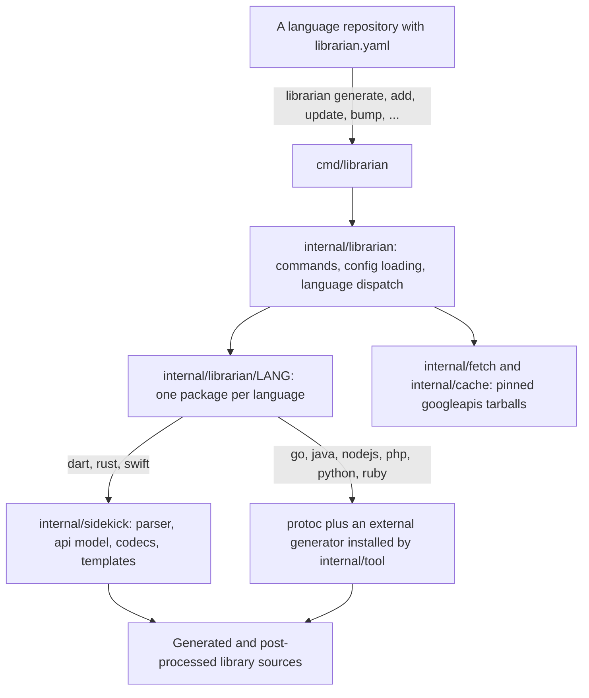
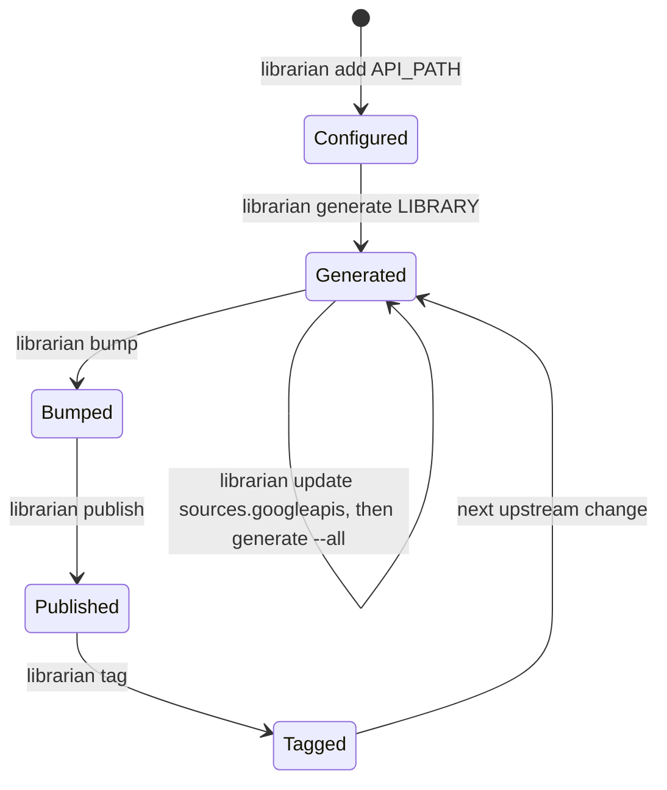

# Librarian architecture

Librarian is a single Go binary that onboards, generates and releases Google
Cloud client libraries. A language repository such as `google-cloud-go` or
`google-cloud-rust` keeps one `librarian.yaml` at its root, and every
Librarian command reads that file to decide what to do. This directory explains
how the code that implements those commands is organised.

The documents describe the repository at commit `d8be62b8` (v0.47.0). Package
names and layering change slowly; exact line numbers do not, so the documents
point at files and functions rather than lines.

## Which document to read

| Document | Read it when you want to know |
| :--- | :--- |
| This page | The big picture: what lives where and how the pieces fit. |
| [CLI and commands](/doc/architecture/cli-and-commands.md) | What each `librarian` command does, step by step, with sequence diagrams for `generate`, `add`, `update` and the release commands. |
| [Configuration and service config](/doc/architecture/config-and-serviceconfig.md) | The `librarian.yaml` data model, how defaults and preview libraries are resolved, and how `sdk.yaml` and Google API service configs feed in. |
| [Sidekick generation engine](/doc/architecture/sidekick.md) | How protobuf, OpenAPI and Discovery specs become an `api.API` model and how codecs turn that model into source files with Go templates. |
| [Language integrations](/doc/architecture/languages.md) | One section per language: which generator runs, which tools it needs, what post-processing happens and how releases work. |
| [Package dependencies](/doc/architecture/dependencies.md) | The import graph, the layering rules, the external modules, and how to regenerate the data. |
| [CI and integration](/doc/architecture/ci-and-integration.md) | What each GitHub workflow checks, how Librarian itself is released, and how a language repository consumes Librarian. |

Suggested reading order for a new contributor: this page, then
[CLI and commands](/doc/architecture/cli-and-commands.md), then the
[language](/doc/architecture/languages.md) you will work on.

## Repository map

| Path | Contents |
| :--- | :--- |
| `cmd/librarian/` | `main.go` (calls `librarian.Run`), the generated `doc.go` help text and a multi-language `Dockerfile`. |
| `cmd/config_doc_generate.go` | Build-tagged generator for `doc/config-schema.md` and `doc/sdk-yaml-schema.md`. |
| `internal/librarian/` | Command implementations and orchestration. Nine subdirectories, one per language, hold the language-specific steps. |
| `internal/sidekick/` | The in-process code generation engine: spec parsers, the language-neutral API model, the template engine and the Dart, Rust and Swift codecs. |
| `internal/config/` | Pure data types mirroring `librarian.yaml`. No functions. |
| `internal/serviceconfig/` | Google API service config parsing plus the embedded `sdk.yaml` exception list. |
| `internal/tool/` | Installers for external toolchains: `protoc`, Maven, pip, pnpm, gem, Composer. |
| `internal/*` (the rest) | Small focused packages: process execution, caching, downloads, git, YAML, licenses, versions, metadata files. |
| `internal/testdata/` | Fixtures: a trimmed `googleapis` tree, Discovery documents, an OpenAPI document, a showcase service config. |
| `tool/cmd/` | Developer tools, not shipped: the CI coverage runner, help-text generator, Docker image builder, .NET config migrator. |
| `doc/` | Documentation, including generated schema references and the style guides. |
| `.github/` | Twelve workflows and four composite actions; see [CI and integration](/doc/architecture/ci-and-integration.md). |
| `action.yaml` | The "Setup Librarian" composite action consumed by language repositories. |

## The big picture

Four ideas explain most of the code:

1.  **Everything is driven by `librarian.yaml`.** The file names the language,
    the Librarian version, the pinned source commits, the tool versions, the
    per-language defaults and every library. `internal/config` is the schema;
    `internal/librarian` reads it (always from the current directory), fills
    in defaults and dispatches on `language`.
1.  **There are two generation strategies.** Dart, Rust and Swift are generated
    in-process by the sidekick engine, which parses the API specification into
    an `api.API` model and renders Go templates. Go, Java, Node.js, PHP, Python
    and Ruby shell out to `protoc` and an external GAPIC generator that
    `librarian install` has placed in the cache.
1.  **Languages are dispatched by `switch`, not by an interface.** There is no
    Go interface that a language package implements. `internal/librarian`
    contains about fifteen `switch cfg.Language` blocks plus two maps in
    `tidy.go`; each language package exports plain functions such as
    `Generate`, `Format`, `Install`, `Bump` or `Publish` as needed. The
    [CLI document](/doc/architecture/cli-and-commands.md#the-implicit-language-contract)
    tabulates which language implements which.
1.  **Shared behaviour lives in small leaf packages.** Process execution
    (`command`), downloads (`fetch`), the on-disk cache (`cache`), git, YAML,
    semantic versions, `.repo-metadata.json` and snippet metadata are each
    their own package with no knowledge of commands or languages. The
    [dependency rules](/doc/architecture/dependencies.md#layering-rules) keep
    it that way.

## Package inventory

Sizes are non-test Go lines at the snapshot commit; tests add roughly twice as
much again (51k lines of code, 101k lines of tests, 177 Go templates).

### Entry points and orchestration

| Package | Lines | Responsibility |
| :--- | ---: | :--- |
| `cmd/librarian` | 259 | `main`; the urfave/cli application lives in `internal/librarian`. |
| `internal/librarian` | 4,347 | Command registration, `librarian.yaml` loading, defaults and preview resolution, source fetching, language dispatch, release flow. |

### Language integrations (`internal/librarian/...`)

| Package | Lines | Generator | Notes |
| :--- | ---: | :--- | :--- |
| `dart` | 977 | sidekick | HTTP/JSON clients; publishes to pub.dev. |
| `golang` | 2,076 | protoc + protoc-gen-go_gapic | Three protoc passes; `go mod tidy`; per-library tags. |
| `java` | 3,621 | protoc + gapic-generator-java (Maven) | Only user of `internal/postprocessing`; POM and BOM maintenance. |
| `nodejs` | 1,293 | gapic-generator-typescript (pnpm) | Staging directory then `combine-library`. |
| `php` | 1,213 | protoc + gapic-generator-php (Composer) | `owl-bot-staging` then `php-post-processor` and `owlbot.py`. |
| `python` | 1,422 | protoc + gapic-generator-python (pip) | `owl-bot-staging` then synthtool `owlbot_main`; `nox -s format`. |
| `ruby` | 1,470 | protoc + gapic-generator-ruby (gem) | Multi-wrapper gems; `toys` tasks. |
| `rust` | 2,094 | sidekick (`rust` + `rust_prost`) | Cargo workspace updates; publishes to crates.io. |
| `swift` | 2,084 | sidekick + protoc --swift_out | Splits git history into per-package repositories on publish. |

### Generation engine (`internal/sidekick/...`)

| Package | Lines | Responsibility |
| :--- | ---: | :--- |
| `api` | 4,916 | Language-neutral model: `API`, `Service`, `Method`, `Message`, `Field`, `Enum`, resources, pagination, LROs, cross-references, validation. |
| `parser` | 2,692 | `CreateModel`: protobuf (via `protoc` descriptor sets), OpenAPI and Discovery front-ends plus mixins and fixed post-passes. |
| `parser/discovery` | 1,427 | Discovery-document front-end. |
| `parser/httprule` | 355 | `google.api.http` path template parsing. |
| `parser/svcconfig` | 62 | Service-config helpers shared by parsers. |
| `protobuf` | 83 | Finds the `.proto` input files for a spec directory. |
| `language` | 563 | Go `text/template` wrapper: template discovery, `include`/`indent`, strict missing-key mode, AST lint; Markdown doc-link rewriting. |
| `rust`, `rust_prost` | 4,422 + 274 | Rust codec (98 templates) and the hybrid prost/tonic path for gRPC types. |
| `swift` | 5,011 | Swift codec (54 templates); the reference structure for new codecs. |
| `dart` | 1,966 | Dart codec (17 templates). |
| `codec_sample` | 353 | Unreferenced teaching skeleton for a new codec. |

### Domain services

| Package | Lines | Responsibility |
| :--- | ---: | :--- |
| `internal/config` | 1,838 | `librarian.yaml` schema as Go structs. |
| `internal/serviceconfig` | 659 | Service config YAML to protobuf; embedded `sdk.yaml` overrides (369 entries). |
| `internal/sources` | 110 | Resolved source roots (`googleapis`, `discovery`, `showcase`, ...) and path lookup over active roots. |
| `internal/repometadata` | 235 | `.repo-metadata.json` model and builder. |
| `internal/postprocessing` | 660 | Declarative `postprocess:` steps: replace, regex replace, copy and remove files, method operations. |
| `internal/snippetmetadata` | 164 | Reformat and version-bump `snippet_metadata*.json`. |
| `internal/semver` | 421 | SemVer parse, compare, derive next (including preview rules). |
| `internal/proto` | 108 | Enumerate `.proto` files; regex search in the first proto. |
| `internal/license` | 52 | Apache header lines. |
| `internal/docuploader` | 154 | `docs.metadata.json` and doc tarballs. Currently imported by nothing. |

### Infrastructure and tool installers

| Package | Lines | Responsibility |
| :--- | ---: | :--- |
| `internal/command` | 222 | The one way to run subprocesses (`command.Run`, `Output`, `RunStreaming`), with `--verbose` support. |
| `internal/cache` | 58 | `$LIBRARIAN_CACHE` (default `~/.cache/librarian`) and `$LIBRARIAN_BIN`. |
| `internal/fetch` | 473 | GitHub tarball download with SHA-256 verification, retries and extraction into the cache; latest-commit lookup. |
| `internal/filesystem` | 195 | Move-and-merge with `keep` rules, copy, unzip, prune empty directories. |
| `internal/git` | 276 | Thin wrappers over the `git` CLI; gitignore matching via go-git. |
| `internal/yaml` | 178 | The only YAML entry point: generic read/write with license header and yamlfmt. |
| `internal/tool/protoc` | 183 | Downloads a pinned `protoc` release; `BinaryPathOrSystem`. |
| `internal/tool/{maven,pip,pnpm,gem,composer}` | 76–230 each | Install a language generator into the cache and expose wrapper paths. |

### Test support and developer tools

| Package | Lines | Responsibility |
| :--- | ---: | :--- |
| `internal/testhelper` | 340 | Temporary git repositories, `RequireCommand`, fake executables. Imported only by tests. |
| `internal/sample` | 548 | Canned `config.Config`, `api.API`, service config and repo metadata (uses the `fake` language). |
| `internal/sidekick/api/apitest` | 95 | `go-cmp` helpers for `api` structures. |
| `tool/cmd/coverage` | 137 | `go test -race` with an 80% coverage gate; every CI job uses it. |
| `tool/cmd/docgen` | 449 | Regenerates `cmd/librarian/doc.go` from `--help` output. |
| `tool/cmd/builddockerimages` | 121 | Builds the per-language Docker images. |
| `tool/cmd/migrate` | 300 | Converts a legacy .NET `generator-input/apis.json` into `librarian.yaml`. |

## Library lifecycle

A library moves through the states below. Which transitions Librarian performs
itself depends on the language; for Go, Node.js, Python and Ruby the version
bump, changelog and tag are produced by release-please, whose manifest and
config `librarian add` keeps in sync.

-   **Configured**: `librarian add` validates the API path against the pinned
    `googleapis` checkout, derives the library name, resolves dependencies
    such as mixins and writes the library entry (and release-please config
    where applicable) back to `librarian.yaml`.
-   **Generated**: `librarian generate` fetches the pinned sources into the
    cache, cleans the previous output according to `keep` rules, runs the
    language generator and its post-processing, formats the result and writes
    `.repo-metadata.json`.
-   **Bumped**: `librarian bump` compares the library against its last tag and
    derives the next version with `internal/semver`.
-   **Published**: `librarian publish` pushes to pub.dev (Dart), crates.io
    (Rust) or per-package git repositories (Swift). Other languages publish
    through their own release automation.
-   **Tagged**: `librarian tag` creates local git tags for the libraries in the
    latest release commit.

## Keeping these documents accurate

-   The dependency tables are generated; see
    [Regenerating this data](/doc/architecture/dependencies.md#regenerating-this-data).
-   `doc/config-schema.md` and `doc/sdk-yaml-schema.md` are generated by
    `go generate ./...` and checked by CI, so the configuration document here
    links to them instead of repeating field lists.
-   When adding a language, a command or a package, update the matching table
    in this directory in the same pull request.

## See also

-   [Developer guide](/doc/developer-guide.md)
-   [How we write Go](/doc/howwewritego.md)
-   [Contributing](/CONTRIBUTING.md)
-   [Sidekick agent instructions](/internal/sidekick/AGENTS.md)
