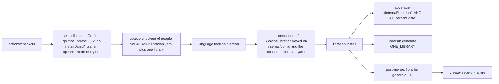
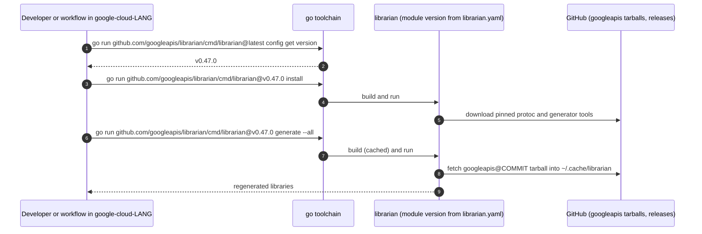

# CI and integration

This document covers the GitHub workflows that gate changes to this
repository, the repository-wide hygiene checks they run, how Librarian itself
is versioned and released, and how a language repository consumes Librarian.

## Workflows

All twelve workflows live in [.github/workflows](/.github/workflows). Unless
noted, each triggers on `push`, `pull_request` and `merge_group` with no path
filters, sets `permissions: contents: read`, pins every action by SHA, and
gives presubmit jobs a five-minute timeout (longer jobs run only after merge
to `main`).

| Workflow | Name | What it runs | Toolchains | Packages exercised |
| :--- | :--- | :--- | :--- | :--- |
| `ci.yaml` | Librarian | `setup-librarian`; copy the Go test `librarian.yaml` to the root and `librarian install go`; `go run ./tool/cmd/coverage -target=80` over every package **except** the root, `internal/librarian/<lang>`, `internal/sidekick/...`, `internal/sample`, `internal/testhelper`. Opens an issue on failure after merge. | Go, protoc | orchestration, config, support packages, tool installers, `tool/cmd` |
| `go.yaml` | Go | Matrix: unit coverage of `internal/librarian/golang`; smoke test in a `google-cloud-go` checkout (`librarian install`, `librarian generate secretmanager`). Post-merge `generate --all` (60 min). | Go, protoc | `internal/librarian/golang` |
| `java.yaml` | Java | Sparse checkout of `google-cloud-java`, Java 17 and Maven, cached `~/.cache/librarian`, `librarian install`, wrapper verification; unit coverage and smoke `generate secretmanager`. Post-merge `generate --all` (120 min). | Go, protoc, Java 17, Maven | `internal/librarian/java` |
| `python.yaml` | Python | `setup-librarian` with Python; sparse checkout of `google-cloud-python` including `.librarian`; `librarian -v install python`; unit coverage and smoke `generate google-cloud-secret-manager`. Post-merge `generate --all`. | Go, protoc, Python 3.14 | `internal/librarian/python` |
| `nodejs.yaml` | Node.js | `setup-librarian` with pnpm; cached tools; sparse checkout of `google-cloud-node`; `librarian -v install nodejs`; unit coverage and smoke `generate google-cloud-secretmanager`. Post-merge `generate --all`. | Go, protoc, Node 22, pnpm 10 | `internal/librarian/nodejs` |
| `php.yaml` | PHP | Separate unit and smoke jobs; sparse checkout of `google-cloud-php`; PHP 8.2 plus Node and Python; `librarian install`; smoke `generate secretmanager`. Post-merge `generate --all`. | Go, protoc, PHP 8.2, pnpm, Python | `internal/librarian/php` |
| `ruby.yaml` | Ruby | Sparse checkout of `google-cloud-ruby`; Ruby 4.0; `ruby_tools/bin` on `PATH`; `librarian install`; unit coverage and smoke `generate google-cloud-asset-v1`. Post-merge `generate --all` (120 min). | Go, protoc, Ruby 4.0 | `internal/librarian/ruby` |
| `dart.yaml` | Dart | Dart 3.9; coverage over `internal/sidekick/dart` and `internal/librarian/dart`. No smoke or post-merge job. | Go, protoc, Dart | `internal/sidekick/dart`, `internal/librarian/dart` |
| `sidekick.yaml` | Sidekick (Rust, Swift) | Stable Rust and taplo; coverage over `internal/sidekick/...`, `internal/librarian/rust`, `internal/librarian/swift`. Post-merge: `google-cloud-rust` checkout, `librarian install -v`, `generate --all`, `cargo check -p google-cloud-showcase-v1beta1`. No Swift end-to-end job. | Go, protoc, Rust, taplo | `internal/sidekick/**`, `internal/librarian/{rust,swift}` |
| `linter.yaml` | Linter | Seven independent jobs: `addlicense`, `typos` (crate-ci/typos with `.typos.toml`), `yamlfmt`, `goimports`, `golangci-lint`, `gomodtidy`, `gogenerate`; each runs one test from [all_test.go](/all_test.go). | Go | whole repository |
| `multi_approvers.yaml` | multi-approvers | `pull_request_target`; enforces two approvals from the `googlers` team with an allowlist for bots. The only workflow using a secret (`MULTI_APPROVERS_TOKEN`). | — | — |
| `create-issue-on-failure.yaml` | Create Issue on Failure | `workflow_call` with `language` and `repository` inputs; comments on an existing open issue or creates one labelled `:rotating_light: critical`, assigned to the actor and mentioning the team. | — | — |

### The shape of a language workflow

Because the smoke tests run against the real language repositories at their
`main`, a change in a consumer repository can break Librarian's presubmit and
vice versa; the post-merge issue automation exists to surface that quickly.

### Composite actions

| Action | Purpose |
| :--- | :--- |
| [setup-librarian](/.github/actions/setup-librarian/action.yaml) | Go from `go.mod` with module and build caches, `install-protoc`, `go install tool`, `go install ./cmd/librarian`; optional Node 22 with pnpm 10 and Python 3.14. |
| [install-protoc](/.github/actions/install-protoc/action.yaml) | Downloads protoc (default 33.2, SHA-512 checked) into `/usr/local`. Also referenced by the root `action.yaml`. |
| [install-taplo](/.github/actions/install-taplo/action.yaml) | taplo 0.10.0 for the Rust jobs. |
| [create-issue-on-failure](/.github/actions/create-issue-on-failure/action.yaml) | `gh issue list/create/comment` wrapper used by the post-merge jobs. |

## Repository-wide checks

[all_test.go](/all_test.go) in the root package turns each hygiene tool into
a Go test so that `go test ./...` on a fresh clone runs them too:

| Test | Command | Fails when |
| :--- | :--- | :--- |
| `TestGolangCILint` | `go tool golangci-lint run` | any enabled linter reports an issue. [.golangci.yaml](/.golangci.yaml) enables `containedctx`, `contextcheck`, `fatcontext`, `godoclint`, `godot`, `govet`, `ineffassign`, `misspell`, `modernize`, `staticcheck`, `unparam`, `unused`, `usetesting`. |
| `TestGoImports` | `go tool goimports -d .` | any file would change. |
| `TestGoModTidy` | `go mod tidy -diff` | `go.mod`/`go.sum` are not tidy. |
| `TestYAMLFormat` | `go tool yamlfmt -lint .` | any YAML file is not formatted. |
| `TestAddLicense` | `go tool addlicense -check -c "Google LLC" -l apache -ignore "**/*pom.xml" .` | a file lacks the Apache header. |
| `TestGoGenerate` | `go generate ./...` then `git status --porcelain` | `cmd/librarian/doc.go`, `doc/config-schema.md` or `doc/sdk-yaml-schema.md` are stale. |

The tools come from the `tool` block in `go.mod`, so the first run needs
network access to download them. The `typos` job is the only check that is
not a Go test.

[tool/cmd/coverage](/tool/cmd/coverage/main.go) is the test runner every CI
job uses: `go test -race -coverprofile=coverage.out -covermode=atomic PKGS`,
then `go tool cover -func` and a failure if the total is below the target
(80% by default).

## Developer tools (`tool/cmd`)

| Tool | Purpose |
| :--- | :--- |
| `coverage` | CI test runner with the coverage gate (above). |
| `docgen` | Build tag `docgen`. Regenerates [cmd/librarian/doc.go](/cmd/librarian/doc.go) by running the CLI with `--help` for every command and rendering the output; invoked through `go:generate`. |
| `builddockerimages` | Builds the per-language images from [cmd/librarian/Dockerfile](/cmd/librarian/Dockerfile) and tags them `librarian-LANG:VERSION`. |
| `migrate` | One-off: converts a `google-cloud-dotnet` `generator-input/apis.json` into `librarian.yaml` by building a `config.Config` and calling `librarian.RunTidyOnConfig`. |

## How Librarian itself is released

-   Commits follow the conventional format `type(package): description`
    described in [CONTRIBUTING.md](/CONTRIBUTING.md); PRs are squash-merged.
-   [release-please-config.json](/release-please-config.json) declares a
    single Go package at `.`; [.release-please-manifest.json](/.release-please-manifest.json)
    holds the current version (`0.47.0` at the snapshot). release-please
    opens release PRs from the conventional commits and tags `vX.Y.Z` on
    `main` (and on the `antique-librarian` branch).
-   `librarian version` reports `info.Main.Version` from Go build info,
    which is the module version when installed with `go install ...@vX.Y.Z`
    and `(devel)` for local or dirty builds.
-   `go.mod` retracts `v1.0.0` and `v1.0.1`, which were published
    prematurely; the module is still on `v0`.

## Consumer perspective

A language repository such as `google-cloud-go` does not vendor or build
Librarian. It pins a version in `librarian.yaml` and runs the released module.

### The `Setup Librarian` action

The root [action.yaml](/action.yaml) is a composite action for consumer
workflows:

1.  `actions/setup-go` with `go-version-file` pointing at **Librarian's**
    `go.mod`, so the Go version is the one Librarian needs.
1.  `googleapis/librarian/.github/actions/install-protoc@main`.
1.  `VERSION=$(sed -n 's/^version: *//p' librarian.yaml)` if the consumer
    has a `librarian.yaml`, else `latest`; then
    `go install github.com/googleapis/librarian/cmd/librarian@$VERSION`.

A consumer step is therefore `uses: googleapis/librarian@REF` after checking
out its own repository, followed by plain `librarian ...` commands. Inputs
`protoc-version` and `protoc-checksum` override the protoc release.

### What a consumer repository contains

| Item | Location | Notes |
| :--- | :--- | :--- |
| Configuration | `librarian.yaml` at the repository root | Read relative to the working directory, so every command runs from the root. There is no `.librarian/state.yaml` or similar state file. |
| Python post-processing scripts | `.librarian/generator-input/client-post-processing/` | Copied into the package during Python generation for synthtool; Python repositories only. |
| Generated metadata | `<library>/.repo-metadata.json` | Written by Go, Java, Node.js, Python, Rust and Swift. |
| Doc index | `<default.output>/_libraries.json` | Rust and Swift only. |
| release-please files | `release-please-config.json`, `.release-please-manifest.json` (Python: bulk and individual pairs) | Kept in sync by `librarian add` for Go, Node.js, Python and Ruby. |
| Tool cache | `~/.cache/librarian` (`LIBRARIAN_CACHE`), `~/.cache/librarian/bin` (`LIBRARIAN_BIN`) | Sources as `<repo>@<commit>/` plus `download/*.tar.gz`; tools under `<lang>_tools`. CI caches this directory keyed on `internal/config/**` and the consumer `librarian.yaml`. |

Useful overrides while developing:

-   `sources.googleapis.dir: /path/to/googleapis` uses a local checkout
    instead of downloading.
-   `tools.maven[].local_path`, `tools.pip[].local_path`,
    `tools.composer[].local_path`, `tools.swift[].local_path` build or use a
    local generator.
-   `LIBRARIAN_CACHE` and `LIBRARIAN_BIN` relocate the cache (handy for
    tests and containers).
-   [cmd/librarian/Dockerfile](/cmd/librarian/Dockerfile) builds per-language
    images that bundle the toolchain:
    `docker run --rm -v "$(pwd)":/workspace -w /workspace librarian:rust generate`.

Release commands expect a git remote named `upstream` pointing at the
canonical repository and a default branch `main` (`config.RemoteUpstream`,
`config.BranchMain`).

### Typical consumer workflows

| Goal | Commands |
| :--- | :--- |
| Onboard an API | `librarian add google/cloud/foo/v1`, review `librarian.yaml`, `librarian generate foo` |
| Pick up upstream proto changes | `librarian update sources.googleapis`, `librarian generate --all` |
| Move to a newer Librarian | `librarian update version` (or `config set version vX.Y.Z`), then `librarian install` |
| Prepare a release (Dart, Go, Python, Rust, Swift) | `librarian bump --all`, commit, merge; then `librarian publish` (Dart, Rust, Swift) and `librarian tag` |
| Diagnose tool locations | `librarian debug env` |

## Contributing conventions in brief

[CONTRIBUTING.md](/CONTRIBUTING.md) is authoritative; the points that most
affect day-to-day work are:

-   Open or comment on an issue before coding; issue titles are prefixed with
    the package or language (`java:`, `cli:`).
-   Go only, no new dependencies without an issue, `internal/config` stays
    pure data, `internal/yaml` is the only YAML entry point, `command.Run`
    for subprocesses.
-   Run `gofmt -s -w .`, `go tool goimports -w .`,
    `go tool golangci-lint run`, `go test -short ./...` before pushing and
    `go test -race ./...` before submitting.
-   Tests must pass on a fresh clone with only `go` installed; tests that
    need other tools skip via `testhelper.RequireCommand`. Presubmit jobs stay
    under five minutes.
-   Two Googler approvals, squash merges, never force-push.

## See also

-   [Architecture overview](/doc/architecture/README.md)
-   [Developer guide](/doc/developer-guide.md)
-   [CONTRIBUTING.md](/CONTRIBUTING.md)
-   [Language integrations](/doc/architecture/languages.md) for what each
    smoke test exercises
