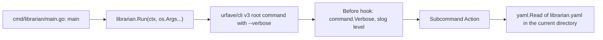
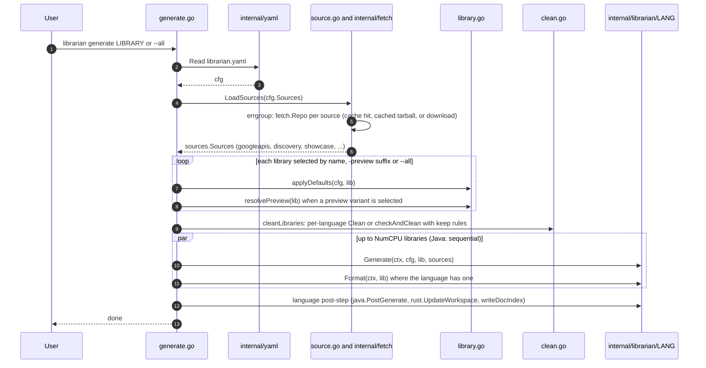
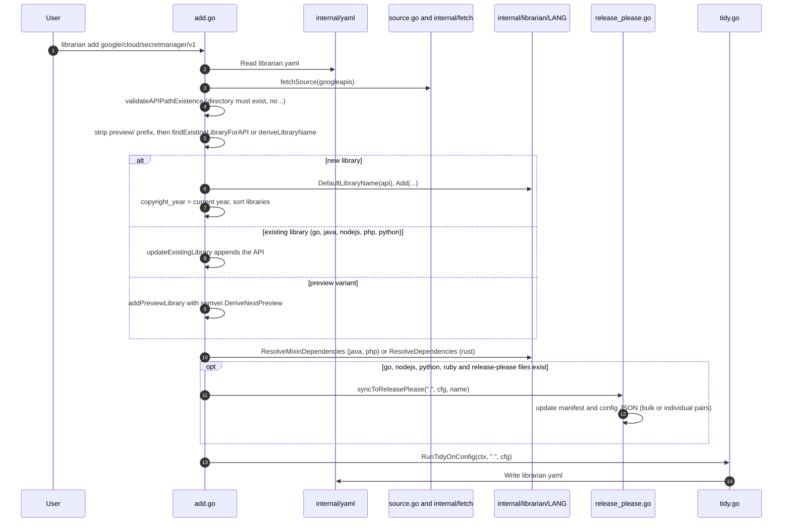
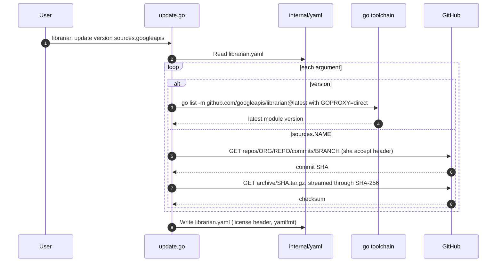
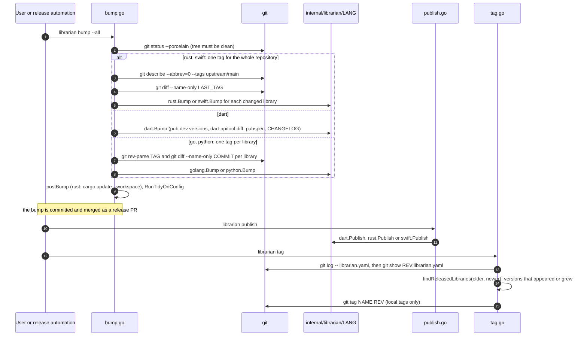

# CLI and commands

This document follows a `librarian` invocation from `main` to the language
packages. It covers how commands are registered, how `librarian.yaml` is loaded
and defaulted, the implicit contract between `internal/librarian` and the
language packages, and the step-by-step flow of the important commands.

Paths are relative to the repository root; the code lives in
[internal/librarian](/internal/librarian).

## Startup

1.  [main.go](/cmd/librarian/main.go) calls `librarian.Run` and prints any
    error as `librarian: ...` before exiting with status 1.
1.  `Run` in [librarian.go](/internal/librarian/librarian.go) builds the root
    `*cli.Command`. The only global flag is `--verbose/-v`; the `Before` hook
    copies it into the package-level `command.Verbose` and configures `slog`
    (text handler on stderr, `Warn` by default, `Debug` when verbose).
1.  Subcommands are registered in this order: `config`, `add`, `generate`,
    `bump`, `install`, `tidy`, `update`, `publish`, `tag`, `version`, `debug`.
    `bump`, `publish` and `tag` are `Hidden: true`, so they do not appear in
    `--help` or in the generated [doc.go](/cmd/librarian/doc.go).
1.  Every `Action` loads configuration itself with
    `yaml.Read[config.Config]("librarian.yaml")`. The path is relative to the
    process working directory: there is no search for a repository root, so
    commands must run from the directory that holds `librarian.yaml`. The
    exceptions are `install` (tolerates a missing file when a language
    argument is given), `version` and `debug env` (never read it) and `tag`
    (reads historical copies from git instead).

## Commands

| Command | File | Arguments and flags | What it does |
| :--- | :--- | :--- | :--- |
| `config get` | [config.go](/internal/librarian/config.go) | `version`, `libraries API_PATH`, `sources.NAME.{commit,sha256,dir,subpath}` | Prints one value from `librarian.yaml`; `libraries` fetches googleapis to map an API path to its library name. |
| `config set` | [config.go](/internal/librarian/config.go) | `version V`, `sources.NAME.commit BRANCH`, `sources.NAME.{sha256,dir,subpath} V` | Sets one value and rewrites the file; setting `commit` to a branch resolves the head SHA and tarball checksum from GitHub. |
| `add` | [add.go](/internal/librarian/add.go) | `API_PATH` (prefix `preview/` for a preview variant); `--name` (Ruby only) | Registers an API in `librarian.yaml`: derives the library name and defaults, resolves dependencies, syncs release-please config, tidies. |
| `generate` | [generate.go](/internal/librarian/generate.go) | `LIBRARY` or `--all` (`LIBRARY-preview` selects the preview variant) | Fetches sources, applies defaults, cleans output directories, runs the language generator and formatter. |
| `bump` (hidden) | [bump.go](/internal/librarian/bump.go) | `LIBRARY` or `--all`; `--version V` | Derives the next version of each changed library and updates manifests and `librarian.yaml`. |
| `install` | [install.go](/internal/librarian/install.go) | `[LANGUAGE]` | Installs `protoc` (if `tools.protoc` is set) and the language toolchain into the cache. |
| `tidy` | [tidy.go](/internal/librarian/tidy.go) | none | Validates `librarian.yaml`, removes derivable values, sorts and rewrites it. |
| `update` | [update.go](/internal/librarian/update.go) | one or more of `version`, `sources.{conformance,discovery,googleapis,protobuf,showcase}` | Refreshes the pinned Librarian version or source commits and checksums. |
| `publish` (hidden) | [publish.go](/internal/librarian/publish.go) | `--dry-run`, `--dry-run-keep-going`, `--skip-semver-checks`, `--force`, `--remote-url-format`, `--origin`, `--remote-branch`, `--upstream`, `--concurrency`; library names (Swift) | Publishes the libraries released by the latest bump; Dart, Rust and Swift only. |
| `tag` (hidden) | [tag.go](/internal/librarian/tag.go) | `--release-commit SHA` | Creates one local git tag per library released by a commit, using `default.tag_format`. |
| `version` | [version.go](/internal/librarian/version.go) | none | Prints the version from Go build info (`(devel)` for local builds). |
| `debug env` | [debug.go](/internal/librarian/debug.go) | none | Prints `LIBRARIAN_CACHE`, `LIBRARIAN_BIN` and each language's tool directory. |

Three files in the package are helpers that are often mistaken for commands:
[clean.go](/internal/librarian/clean.go) (`checkAndClean`, run by `generate`),
[docindex.go](/internal/librarian/docindex.go) (`_libraries.json`, written by
`generate` for Rust and Swift) and
[release_please.go](/internal/librarian/release_please.go) (run by `add`).

The usage line of every command is checked by
[usage_test.go](/internal/command/usage_test.go), which runs the real binary
with `--help`.

## Configuration loading and defaults

The data model is described in
[Configuration and service config](/doc/architecture/config-and-serviceconfig.md).
What matters here is *when* each step runs:

| Step | Function | Runs during |
| :--- | :--- | :--- |
| Read | `yaml.Read[config.Config]` | every command that needs it |
| Validate | `validateTools`, `validateLibraries`, `java.Validate`, `php.Validate` | `tidy`, and the `RunTidyOnConfig` call at the end of `add` and `bump` only. `generate` does not validate. |
| Default | `applyDefaults` → `fillDefaults` → `fill<Lang>` → `fillLibraryDefaults` (`<lang>.Fill`) in [library.go](/internal/librarian/library.go) | `generate` (per selected library) and the doc index |
| Preview | `resolvePreview` + `merge<Lang>` in [library.go](/internal/librarian/library.go) | `generate` when a preview variant is selected or `--all` is used |
| Write | `RunTidyOnConfig` → `formatConfig` → `yaml.Write` | `add`, `bump`, `tidy`; `update` and `config set` write directly |

`applyDefaults` also derives missing pieces: for Dart, Rust, Swift (and the
fake language) a library with no `apis` gets one derived from its name, and a
missing `output` is derived by the language's `DefaultOutput` unless the
library is "mixed" (`IsMixedLibrary` is true for Rust, Swift and Node.js
libraries with several modules or packages), in which case `output` is
required.

## The implicit language contract

`internal/librarian` never defines a Go interface for languages. Each
`internal/librarian/<lang>` package exports plain functions and the
orchestration layer calls them from `switch cfg.Language` statements
(in `generate.go`, `add.go`, `bump.go`, `install.go`, `library.go`,
`publish.go`, `debug.go`) and from two maps in `tidy.go`
(`languageValidators`, `languageTidiers`). The table lists the hooks and who
implements them; a blank cell means the orchestration layer has a default or
the command is unsupported for that language.

| Hook | Called from | dart | go | java | nodejs | php | python | ruby | rust | swift |
| :--- | :--- | :---: | :---: | :---: | :---: | :---: | :---: | :---: | :---: | :---: |
| `Generate(ctx, cfg, lib, sources)` | `generateLibraries` | x | x | x | x | x | x | x | x | x |
| `Format(ctx, lib)` | `generateLibraries` | x | x | x (all libraries at once) | | x | | x | x | x |
| post-generate step | `generateLibraries` | | | `PostGenerate` | | | | | `UpdateWorkspace`, doc index | doc index |
| `Clean(lib)` | `cleanLibraries` | keep rules | x | x | x | x | x | x | `Keep` + keep rules | keep rules |
| `DefaultOutput(name or API path, default)` | `applyDefaults` | x | x | x | x | x | x | x | x | x |
| `DeriveAPIPath(name)` | `applyDefaults` | x | | | | | | | x | |
| `IsMixedLibrary(lib)` | `applyDefaults` | | | | x | | | | x | x |
| `Fill(lib)` | `fillLibraryDefaults` | | x | x | x | x | x | | | |
| `DefaultLibraryName(api)`, `Add(...)` | `addNewLibrary` | x | x | x | x | x | x | x | x | x |
| `FindExistingLibraryForNewAPI` | `findExistingLibraryForAPI` | | | | x | | x | | | |
| dependency resolution | `resolveDependencies` | | | `ResolveMixinDependencies` | | `ResolveMixinDependencies` | | | `ResolveDependencies` | |
| `Tidy(lib)` | `tidyLanguageConfig` | | x | x | x | x | x | x | x | |
| `Validate(cfg)` | `validateLibraries` | | | x | | x | | | | |
| `Bump(...)` | `runBump` | x | x | | | | x | | x | x |
| `Publish(ctx, PublishParams)` | `publishCommand` | x | | | | | | | x | x |
| `Install(ctx, tools)` | `installCommand` | no-op | x | x | x | x | x | x | x | x |
| `InstallDir()` | `debug env` | | x | x | x | | x | x | | x |
| release-please extras | `syncToReleasePlease` | | `ReleasePleaseExtraFiles` | | | | `ReleasePleaseExtraFiles` | `AddManifest`, `AddPackage` | | |
| doc index helpers | `GenerateDocIndex` | | | | | | | | `DocumentationURL` | `PackageName`, `DocumentationURL` |

Because nothing enforces this contract, adding a language means visiting each
`switch`. The `fake` language (`config.LanguageFake`, implemented in
[fake.go](/internal/librarian/fake.go)) is a tenth participant used only by
tests; see [Testing](#testing-the-cli).

## Command flows

### generate

Details worth knowing:

-   **Source cache.** `fetch.Repo` keeps `$LIBRARIAN_CACHE/download/<repo>@<commit>.tar.gz`
    and the extracted `$LIBRARIAN_CACHE/<repo>@<commit>/`. The SHA-256 from
    `librarian.yaml` is verified before extraction. Setting `sources.NAME.dir`
    bypasses the download entirely.
-   **Selection.** `skip_generate` libraries are skipped unless named
    explicitly. `--all` generates both the stable and the preview variant of a
    library that has a `preview` block.
-   **Cleaning** runs sequentially before any generation. `checkAndClean`
    deletes everything under `output` that is not listed in `keep` and fails
    if a `keep` entry does not exist.
-   **Concurrency** is chosen per language in `generateLibraries`:

    | Languages | Strategy |
    | :--- | :--- |
    | dart, php, ruby, swift | errgroup limited to `runtime.NumCPU()`; each goroutine runs `Generate` then `Format`. Swift then writes the doc index. |
    | go | parallel `Generate` for every library, then a second parallel pass of `Format`. |
    | rust | parallel `Generate`, parallel `Format` (formatting reads dependency `Cargo.toml` files), then `writeDocIndex` and `rust.UpdateWorkspace` (`cargo update --workspace`). |
    | nodejs, python | parallel `Generate` only; formatting happens inside `Generate`. |
    | java | sequential `Generate`, then `java.Format` over all libraries, then `java.PostGenerate`. |

-   **Nothing is written to `librarian.yaml`** by `generate`, and there is no
    `--dry-run` flag. The decision between in-process sidekick and an external
    generator is made inside each language's `Generate`; see
    [Language integrations](/doc/architecture/languages.md).
-   The help text mentions `librarian update googleapis` as the typical
    workflow; the command actually accepts `sources.googleapis`.

### add

`syncToReleasePlease` is the only place Librarian knows about release-please.
Python uses bulk and individual config pairs; Node.js and Ruby use
`release-please-config.json` and `.release-please-manifest.json`; Go uses the
bulk pair. Extra files per library come from `golang.ReleasePleaseExtraFiles`
and `python.ReleasePleaseExtraFiles`.

### update

`sourceRepos` in `update.go` maps each source name to its GitHub repository
and default branch (`master` for googleapis and discovery, `main` for the
others). `update` never changes `tools` and never regenerates; the intended
sequence is `librarian update sources.googleapis` followed by
`librarian generate --all`.

### Release: bump, publish, tag

-   `deriveNextVersion` uses `--version` if given (validated by
    `semver.ValidateNext`), `0.1.0` for a never-released library, otherwise
    `semver.DeriveNext(Minor, current, options)`. `languageVersioningOptions`
    gives Rust `BumpVersionCore` plus `DowngradePreGAChanges` and Swift
    `BumpVersionCore`.
-   `IgnoredChanges` (`.repo-metadata.json`, `docs/README.rst`) do not count as
    a change when deciding whether a library needs a bump.
-   Java, Node.js, PHP and Ruby report "does not support bump"; their versions
    are managed by release-please or language-specific tooling.
-   `tag` finds the release commit by walking `git log -- librarian.yaml` and
    diffing consecutive versions of the file. It only creates local tags.

### install

1.  Pick the language from the argument or `cfg.Language`.
1.  If `tools.protoc` is set, `protoc.Install` downloads the pinned release
    into the cache.
1.  Call `<lang>.Install(ctx, cfg.Tools)`. Each language installs into its own
    directory under `$LIBRARIAN_BIN` (default `~/.cache/librarian/bin`):
    `go_tools`, `java_tools`, `nodejs_tools`, `php_tools`, `python_tools`,
    `ruby_tools`, `swift_tools`. Rust uses `cargo install --locked` and Dart
    needs nothing.

### tidy

`RunTidyOnConfig` is the single write path for `librarian.yaml` used by
`add`, `bump` and `tidy`:

1.  `validateTools` (every `tools.cargo` entry needs a version) and
    `validateLibraries` (duplicate names, duplicate API paths except for Java
    and Ruby, then `java.Validate` or `php.Validate`); `sources.googleapis`
    must be set.
1.  `tidyLibrary` removes values equal to their defaults: a derivable
    `output`, `roots: [googleapis]`, `specification_format: protobuf`, a single
    derivable API path. Then `golang.Tidy` or the `languageTidiers` entry.
1.  `tidyConfig` clears empty `tools` and `default` blocks; `formatConfig`
    sorts tools, dependencies, libraries and APIs
    (`serviceconfig.SortAPIs`).
1.  `yaml.Write` prepends the license header and runs yamlfmt.

## External processes and environment

At this layer Librarian shells out, always through `internal/command`, to
`git` (`bump`, `tag`), `go list` (`update version`) and `cargo update`
(`postBump` for Rust). Language packages add many more; see
[Language integrations](/doc/architecture/languages.md).

| Variable | Read by | Meaning |
| :--- | :--- | :--- |
| `LIBRARIAN_CACHE` | `internal/cache` | Root of the cache; default `os.UserCacheDir()/librarian`. Holds downloaded sources. |
| `LIBRARIAN_BIN` | `internal/cache` | Tool install root; default `$LIBRARIAN_CACHE/bin`. |
| `GOPROXY=direct` | set by `update version` | Forces `go list -m` to ask the origin for the latest version. |
| `PATH` | `command.buildCmd` | Entries passed in a command's `env` map are prepended to the inherited `PATH`. |

## Testing the CLI

-   Most command tests run end to end: `t.Chdir(t.TempDir())`, write
    `sample.Config()` with `yaml.Write`, then call
    `Run(t.Context(), "librarian", "generate", ...)`.
-   `sample.Config()` uses `language: fake`. [fake.go](/internal/librarian/fake.go)
    implements the contract minimally: `fakeGenerate` writes `README.md` and
    `VERSION`, `fakeFormat` appends a marker, `fakeClean` deletes `README.md`,
    `fakeBumpLibrary` writes the new version. This keeps orchestration tests
    independent of any toolchain.
-   [internal/testhelper](/internal/testhelper/testhelper.go) builds temporary
    git repositories with tags, changes and an `upstream` remote for the
    release-flow tests, and `RequireCommand` skips tests when a tool such as
    `git` is missing.
-   Network calls in `update` and `config set` go through the package
    variables `githubAPI` and `githubDownload`, which tests point at an
    `httptest.Server`.
-   `verbose_test.go` checks that `-v` sets `command.Verbose` and the slog
    level; `usage_test.go` checks every command's usage line.

## See also

-   [Architecture overview](/doc/architecture/README.md)
-   [Configuration and service config](/doc/architecture/config-and-serviceconfig.md)
-   [Language integrations](/doc/architecture/languages.md)
-   [CLI reference](/cmd/librarian/doc.go) (generated from `--help`)
