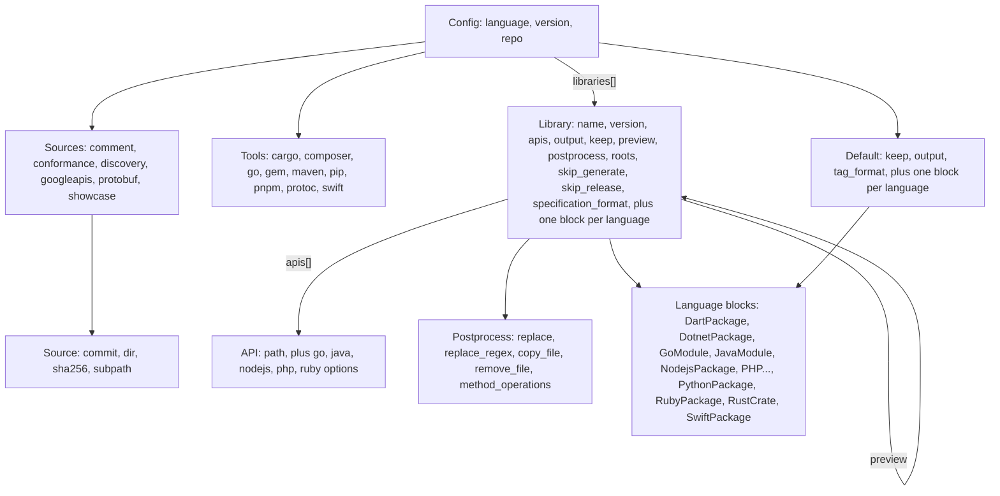
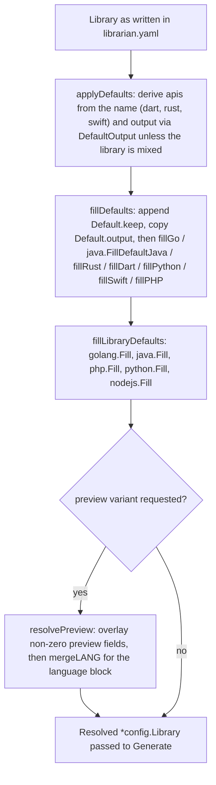
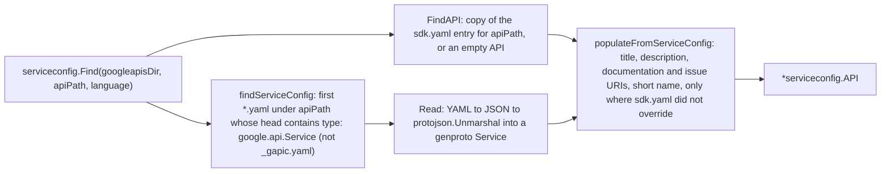

# Configuration and service config

Librarian has three configuration inputs, layered from most general to most
specific:

1.  **Google API service config** (`*.yaml` with `type: google.api.Service`
    next to the protos in `googleapis`): owned by API teams, describes the
    service, its documentation, HTTP rules and mixins.
1.  **`sdk.yaml`** (embedded in the binary from
    [internal/serviceconfig/sdk.yaml](/internal/serviceconfig/sdk.yaml)):
    language-neutral exceptions maintained by the Librarian team, such as
    transport or release-level overrides.
1.  **`librarian.yaml`** (at the root of each language repository):
    language-specific and library-specific settings.

This document covers the Go packages that model and read them:
[internal/config](/internal/config), [internal/yaml](/internal/yaml),
[internal/serviceconfig](/internal/serviceconfig) and
[internal/sources](/internal/sources).

## The `librarian.yaml` model

[internal/config](/internal/config) contains only structs, constants and
`yaml` tags. It has no functions, imports only `internal/yaml` (for the
`StringSlice` type) and is documented field by field in the generated
[config-schema.md](/doc/config-schema.md). The structure:



### Per-repository structs

| Struct | Key fields | Notes |
| :--- | :--- | :--- |
| `Config` | `language`, `version`, `repo`, `sources`, `tools`, `default`, `libraries` | `version` is the Librarian version the repository pins (for example `v0.47.0`); `config get version` and the root `action.yaml` read it. |
| `Sources` / `Source` | `googleapis` (required), `discovery`, `showcase`, `protobuf`, `conformance`; each `{commit, dir, sha256, subpath}` | `dir` points at a local checkout and disables downloading. `subpath` makes a subdirectory of the archive the root (used for `protobuf`). |
| `Tools` | lists of `CargoTool`, `ComposerTool`, `GemTool`, `GoTool`, `MavenTool`, `PipTool`, `PNPMTool`, `SwiftTool`; one `Protoc` | Each entry is at least `name` and `version`; Maven adds coordinates, pnpm a build recipe, Composer and Swift a repository. `librarian install` consumes this. |
| `Default` | `keep`, `output`, `tag_format`, and `dart`, `dotnet`, `go`, `java`, `nodejs`, `php`, `python`, `rust`, `swift` | Exactly one language block is expected to be set; `fillDefaults` picks the fill function from whichever pointer is non-nil. |

### Per-library structs

| Struct | Key fields | Notes |
| :--- | :--- | :--- |
| `Library` | `name`, `version`, `apis`, `output`, `keep`, `preview`, `postprocess`, `roots`, `skip_generate`, `skip_release`, `specification_format`, `copyright_year`, `title_override`, `comment` | Field order is deliberate so `name` and `version` serialise first. `preview` is itself a `Library` whose non-zero fields override the base. |
| `API` | `path` plus `go`, `java`, `nodejs`, `php`, `ruby` | `path` is a directory under `googleapis` such as `google/cloud/secretmanager/v1`. Per-API language options cover things like extra protos, excluded protos and generator flags. |
| `Postprocess` | `replace`, `replace_regex`, `copy_file`, `remove_file`, `method_operations` | Declarative fix-ups applied by [internal/postprocessing](/internal/postprocessing); only Java calls it today. |
| Language blocks | `DartPackage`, `DotnetPackage`, `GoModule`, `JavaModule`, `NodejsPackage`, `PythonPackage`, `RubyPackage`, `RustCrate`, `SwiftPackage` | Documented in [config-schema.md](/doc/config-schema.md) and in each language's section of [Language integrations](/doc/architecture/languages.md). |

Three conventions appear throughout:

-   **Inline inheritance.** `RustCrate`, `PythonPackage` and `SwiftPackage`
    embed their `*Default` counterpart with `yaml:",inline"`, so any default
    key is also valid on a library and the merge is field by field.
-   **Tri-state booleans.** `*bool` fields (for example
    `RustDefault.DetailedTracingAttributes`, `JavaAPI.GenerateGAPIC`)
    distinguish "unset" from `false` so a library can override a default in
    either direction.
-   **Shared discovery types.** `CommonDiscovery{operation_id, pollers}` and
    `CommonPoller` are aliased as `RustDiscovery`/`SwiftDiscovery` for
    Discovery-based APIs that need long-running-operation pollers.

Spec formats are constants in [specs.go](/internal/config/specs.go):
`protobuf` (default), `discovery`, `openapi`, `none`. Language identifiers in
[language.go](/internal/config/language.go) include the nine supported
languages plus `dotnet`/`csharp` (configuration only, no generation path),
`fake` (tests), `all` and `unknown`.

### A minimal example

```yaml
language: go
version: v0.47.0
sources:
  googleapis:
    commit: 0123456789abcdef0123456789abcdef01234567
    sha256: 9f0c...   # checksum of the GitHub tarball for that commit
tools:
  go:
    - name: github.com/googleapis/gapic-generator-go/cmd/protoc-gen-go_gapic
      version: v0.59.0
    - name: google.golang.org/protobuf/cmd/protoc-gen-go
      version: v1.36.11
default:
  tag_format: "{name}/v{version}"
libraries:
  - name: secretmanager
    version: 1.15.0
    apis:
      - path: google/cloud/secretmanager/v1
      - path: google/cloud/secretmanager/v1beta2
```

`librarian tidy` would remove nothing here: `output` is derivable, `roots`
defaults to `[googleapis]` and `specification_format` to `protobuf`.

## Defaults and preview resolution

`generate` works on a fully resolved copy of each library. The pipeline in
[library.go](/internal/librarian/library.go):



The fill functions are where language defaults become library values: Go
unions generator features, Rust merges package dependencies and rustdoc
warnings, Dart merges package and prefix maps and dependencies, Python
concatenates `common_gapic_paths`, Swift merges dependencies, PHP copies
`common_resources` to every API. Preview merging (`mergeGo`, `mergeRust`,
...) follows the same shape and leaves `Preview` nil on the result.

## The `internal/yaml` facade

[internal/yaml](/internal/yaml) is the only package that imports
`go.yaml.in/yaml/v3` and `yamlfmt`; the rule "always use `internal/yaml`" in
[AGENTS.md](/AGENTS.md) exists so that formatting and headers stay uniform.

| Function | Behaviour |
| :--- | :--- |
| `Read[T](path)` / `Unmarshal[T](data)` | Generic decode into any struct. |
| `Write(path, value)` | Encodes, prepends the Apache header for the current year (via `internal/license`), formats with yamlfmt's basic formatter, writes the file. Used for `librarian.yaml` and for regenerating `sdk.yaml`. |
| `ClearIfEmpty(ptr)` | Sets a pointer to nil when the struct it points to is empty, so `tidy` can drop empty `tools:` and `default:` blocks. |
| `StringSlice` | A type that accepts either a scalar or a list in YAML; used by `RustModule.DisabledRustdocWarnings` and `IncludeList`. |
| `RefString` | A string type that marshals with a `!REF` YAML tag, for values that reference another resource. |

## Service config and `sdk.yaml`

[internal/serviceconfig](/internal/serviceconfig) answers the question "what
do we know about API path X?" by combining the service config found on disk
with the embedded exception list.



Key types and helpers:

-   `API` ([api.go](/internal/serviceconfig/api.go)) is one `sdk.yaml` entry:
    `path`, `title`, `description`, `short_name`, `service_name`,
    `service_config`, `documentation_uri`, `new_issue_uri`,
    `rest_documentation`, `rpc_documentation`, `sample_uris`,
    `requires_billing`, `discovery`, `open_api`, `transports` (map of
    language to `grpc`, `rest` or `grpc+rest`), `skip_rest_numeric_enums`
    (list of languages) and `release_level` (map of language to level).
-   `(*API).Transport(language)` falls back from the language to `all` to
    `grpc+rest`. `ReleaseLevel(language, version)` falls back to `all`, then
    derives `preview` for alpha/beta paths or `0.x` versions, else `stable`.
-   `APIs` is a package-level slice loaded at init from `//go:embed sdk.yaml`.
    At the snapshot commit it holds 369 entries; the most common keys are
    `transports` (88), `skip_rest_numeric_enums` (81) and `release_level`
    (38). Two entries point at Discovery documents (Compute, DNS) and one at
    an OpenAPI document (Secret Manager, used by tests).
-   `FindGRPCServiceConfig` and `FindGAPICConfig` locate
    `*_grpc_service_config.json` and `*_gapic.yaml` next to the protos and
    fail if there is more than one.
-   `ExtractMixinProtos` maps the mixin services named in the service config
    (`google.cloud.location.Locations`, `google.iam.v1.IAMPolicy`) to the
    proto files external generators must also compile.
-   `SortAPIs` defines the canonical API order used by `tidy` and Java:
    versioned before unversioned, stable before alpha/beta, shallower paths
    first, higher versions first.
-   Type aliases (`Service`, `Documentation`, `Backend`, `Authentication`,
    ...) re-export the genproto types. `TestNoGenprotoServiceConfigImports`
    walks the repository to ensure no other package imports
    `genproto/googleapis/api/serviceconfig` directly.

The principles for what belongs in `sdk.yaml` versus `librarian.yaml` are in
[sdk-yaml-principles.md](/doc/sdk-yaml-principles.md); the field reference is
the generated [sdk-yaml-schema.md](/doc/sdk-yaml-schema.md). Because the file
is embedded, a change to `sdk.yaml` reaches a language repository only when
that repository bumps the `version` in its `librarian.yaml`.

## Sources and active roots

[internal/sources](/internal/sources) is the small leaf package that turns
the fetched directories into something generators can query:

-   `Sources{Conformance, Discovery, Googleapis, ProtobufSrc, Showcase}` holds
    absolute directories, filled by `librarian.LoadSources`.
-   `SourceConfig{ActiveRoots, IncludeList}` is built per library with
    `NewSourceConfig(sources, library.Roots)`. `ActiveRoots` defaults to
    `["googleapis"]`; a library may add `showcase` or `protobuf` to resolve
    paths such as `schema/google/showcase/v1beta1` or
    `src/google/protobuf`.
-   `Resolve(relPath)` / `ResolveDir` return the first active root that
    contains the path. The sidekick parser also passes every active root to
    `protoc` as a `--proto_path`.

## Generated schema documents

Two `go:generate` directives keep the reference documents in sync with the
Go structs:

-   `internal/config/config.go` runs
    `go run -tags configdocgen ../../cmd/config_doc_generate.go` to produce
    [doc/config-schema.md](/doc/config-schema.md).
-   `internal/serviceconfig/api.go` runs the same tool with
    `-root API -title "SDK YAML"` to produce
    [doc/sdk-yaml-schema.md](/doc/sdk-yaml-schema.md).

[config_doc_generate.go](/cmd/config_doc_generate.go) loads the package with
`golang.org/x/tools/go/packages`, walks struct declarations and renders one
table per struct from the `yaml` tags and doc comments. `TestGoGenerate` in
[all_test.go](/all_test.go) runs `go generate ./...` and fails if `git status`
is not clean afterwards, so editing a field comment without regenerating fails
CI.

## See also

-   [Architecture overview](/doc/architecture/README.md)
-   [CLI and commands](/doc/architecture/cli-and-commands.md) for when the
    defaults pipeline runs
-   [config-schema.md](/doc/config-schema.md) and
    [sdk-yaml-schema.md](/doc/sdk-yaml-schema.md) for every field
-   [sdk-yaml-principles.md](/doc/sdk-yaml-principles.md)
