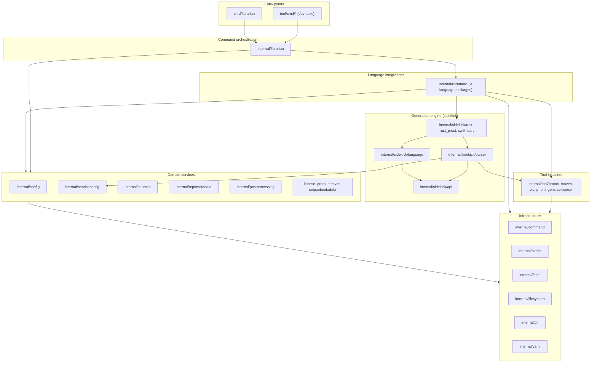
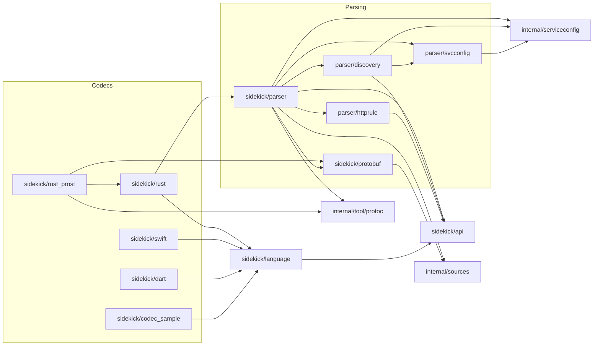
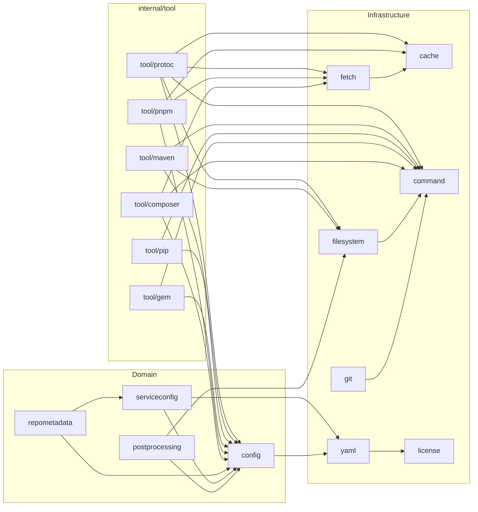

# Package dependencies and layering

This document describes how the Go packages in this repository depend on each
other, the layering rules those dependencies follow, and how to regenerate the
data when the code changes. It is the reference companion to the
[architecture overview](/doc/architecture/README.md).

The tables below were generated from `go list` at commit `d8be62b8` (v0.47.0).
See [Regenerating this data](#regenerating-this-data) to refresh them.

## Layering at a glance

Every package sits in one of the layers below. Arrows point from the importer
to the imported package; a layer only ever imports layers drawn beneath it.



The graph is acyclic. Measured as the longest import chain to a leaf, the
deepest package is `cmd/librarian` at depth 11 and the deepest internal
package is `internal/librarian` at depth 10:

| Depth | Packages |
| :--- | :--- |
| 0 (leaves) | `internal/cache`, `internal/command`, `internal/license`, `internal/proto`, `internal/semver`, `internal/sidekick/api`, `internal/snippetmetadata`, `internal/sources` |
| 1 | `internal/fetch`, `internal/filesystem`, `internal/git`, `internal/sidekick/api/apitest`, `internal/sidekick/language`, `internal/sidekick/parser/httprule`, `internal/sidekick/protobuf`, `internal/yaml` |
| 2 | `internal/config`, `internal/sidekick/dart` |
| 3 | `internal/postprocessing`, `internal/serviceconfig`, `internal/sidekick/codec_sample`, `internal/sidekick/swift`, `internal/tool/*` |
| 4 | `internal/librarian/ruby`, `internal/repometadata`, `internal/sidekick/parser/svcconfig` |
| 5 | `internal/docuploader`, `internal/librarian/golang`, `internal/librarian/java`, `internal/librarian/nodejs`, `internal/librarian/php`, `internal/librarian/python`, `internal/sample`, `internal/sidekick/parser/discovery` |
| 6 | `internal/sidekick/parser`, `internal/testhelper` |
| 7 | `internal/librarian/dart`, `internal/librarian/swift`, `internal/sidekick/rust` |
| 8 | `internal/sidekick/rust_prost` |
| 9 | `internal/librarian/rust` |
| 10 | `internal/librarian` |
| 11 | `cmd/librarian`, `tool/cmd/migrate` |

## Layering rules

These rules hold at the snapshot commit and are the ones worth protecting in
review. The [proposed enforcement test](#proposed-enforcement-test) at the end
of this document checks each of them mechanically.

1.  **Leaf packages import nothing from the module.** `internal/cache`,
    `internal/command`, `internal/license`, `internal/proto`,
    `internal/semver`, `internal/sidekick/api`, `internal/snippetmetadata` and
    `internal/sources` are the foundation everyone else builds on. Keeping
    them leaves is what prevents import cycles as the tree grows.
1.  **`internal/config` is pure data.** It contains only structs, constants
    and `yaml` tags that mirror `librarian.yaml`. Its single module import is
    `internal/yaml`, for the `yaml.StringSlice` type. Reading, writing,
    validating and defaulting configuration all live elsewhere
    (`internal/yaml`, `internal/librarian`).
1.  **The generation engine never imports the CLI layer.** Nothing under
    `internal/sidekick/` imports `internal/librarian` or its language
    packages. The engine is driven through plain function calls from
    `internal/librarian/{dart,rust,swift}`.
1.  **Language integrations are only imported by `internal/librarian`, and
    never by each other.** `internal/librarian/golang` cannot reach into
    `internal/librarian/java`; anything shared must move down into a domain
    or infrastructure package.
1.  **Sidekick language codecs are only imported by their language
    integration.** `internal/sidekick/swift` is used by
    `internal/librarian/swift`, `internal/sidekick/dart` by
    `internal/librarian/dart`, and `internal/sidekick/rust` plus
    `internal/sidekick/rust_prost` by `internal/librarian/rust`.
    (`rust_prost` also imports `rust`, which it extends.)
1.  **One package per third-party concern.** Only `internal/yaml` imports
    `go.yaml.in/yaml/v3` and only `internal/git` imports `go-git`. This is
    the mechanism behind the "always use `internal/yaml`" rule in
    [AGENTS.md](/AGENTS.md).
1.  **Test helpers stay out of production code.** `internal/testhelper` and
    `internal/sidekick/api/apitest` are only imported from `_test.go` files.
    `internal/sample` is imported by `internal/testhelper` and by tests.
1.  **Nothing imports `cmd/` or `tool/`.** Binaries are sinks, not sources.

Two consequences follow from the rules:

-   Adding a language touches `internal/librarian` (the `switch cfg.Language`
    dispatch sites), a new `internal/librarian/<lang>` package and, for
    in-process generation, a new `internal/sidekick/<lang>` package. It never
    touches another language's package.
-   New shared behaviour belongs in a domain package (`serviceconfig`,
    `repometadata`, `postprocessing`, ...) so that both the language
    integrations and the engine can use it without creating a cycle.

## Full adjacency table

Non-test imports only. Test-only imports are listed separately below.

| Package | Imports (module) | Imported by (module) |
| :--- | :--- | :--- |
| `cmd/librarian` | `internal/librarian` | — |
| `internal/cache` | — | `internal/fetch`, `internal/librarian`, `internal/librarian/golang`, `internal/librarian/java`, `internal/librarian/nodejs`, `internal/librarian/php`, `internal/librarian/python`, `internal/librarian/ruby`, `internal/librarian/swift`, `internal/tool/pnpm`, `internal/tool/protoc` |
| `internal/command` | — | `internal/docuploader`, `internal/filesystem`, `internal/git`, `internal/librarian`, `internal/librarian/dart`, `internal/librarian/golang`, `internal/librarian/java`, `internal/librarian/nodejs`, `internal/librarian/php`, `internal/librarian/python`, `internal/librarian/ruby`, `internal/librarian/rust`, `internal/librarian/swift`, `internal/sidekick/dart`, `internal/sidekick/rust_prost`, `internal/testhelper`, `internal/tool/composer`, `internal/tool/gem`, `internal/tool/maven`, `internal/tool/pip`, `internal/tool/protoc`, `tool/cmd/builddockerimages`, `tool/cmd/coverage` |
| `internal/config` | `internal/yaml` | `internal/librarian`, `internal/librarian/dart`, `internal/librarian/golang`, `internal/librarian/java`, `internal/librarian/nodejs`, `internal/librarian/php`, `internal/librarian/python`, `internal/librarian/ruby`, `internal/librarian/rust`, `internal/librarian/swift`, `internal/postprocessing`, `internal/repometadata`, `internal/sample`, `internal/serviceconfig`, `internal/sidekick/codec_sample`, `internal/sidekick/parser`, `internal/sidekick/rust`, `internal/sidekick/rust_prost`, `internal/sidekick/swift`, `internal/testhelper`, `internal/tool/composer`, `internal/tool/gem`, `internal/tool/maven`, `internal/tool/pip`, `internal/tool/pnpm`, `internal/tool/protoc`, `tool/cmd/migrate` |
| `internal/docuploader` | `internal/command`, `internal/repometadata` | — |
| `internal/fetch` | `internal/cache` | `internal/librarian`, `internal/tool/composer`, `internal/tool/pnpm`, `internal/tool/protoc`, `tool/cmd/migrate` |
| `internal/filesystem` | `internal/command` | `internal/librarian/golang`, `internal/librarian/java`, `internal/librarian/nodejs`, `internal/librarian/php`, `internal/librarian/python`, `internal/librarian/ruby`, `internal/librarian/swift`, `internal/postprocessing`, `internal/tool/maven`, `internal/tool/protoc` |
| `internal/git` | `internal/command` | `internal/librarian`, `internal/librarian/dart`, `internal/librarian/rust`, `internal/librarian/swift` |
| `internal/librarian` | `internal/cache`, `internal/command`, `internal/config`, `internal/fetch`, `internal/git`, `internal/librarian/dart`, `internal/librarian/golang`, `internal/librarian/java`, `internal/librarian/nodejs`, `internal/librarian/php`, `internal/librarian/python`, `internal/librarian/ruby`, `internal/librarian/rust`, `internal/librarian/swift`, `internal/repometadata`, `internal/semver`, `internal/serviceconfig`, `internal/sources`, `internal/tool/protoc`, `internal/yaml` | `cmd/librarian`, `tool/cmd/migrate` |
| `internal/librarian/dart` | `internal/command`, `internal/config`, `internal/git`, `internal/semver`, `internal/serviceconfig`, `internal/sidekick/api`, `internal/sidekick/dart`, `internal/sidekick/parser`, `internal/sources` | `internal/librarian` |
| `internal/librarian/golang` | `internal/cache`, `internal/command`, `internal/config`, `internal/filesystem`, `internal/license`, `internal/proto`, `internal/repometadata`, `internal/serviceconfig`, `internal/snippetmetadata`, `internal/sources`, `internal/tool/protoc` | `internal/librarian` |
| `internal/librarian/java` | `internal/cache`, `internal/command`, `internal/config`, `internal/filesystem`, `internal/license`, `internal/postprocessing`, `internal/proto`, `internal/repometadata`, `internal/semver`, `internal/serviceconfig`, `internal/sources`, `internal/tool/maven`, `internal/tool/protoc`, `internal/yaml` | `internal/librarian` |
| `internal/librarian/nodejs` | `internal/cache`, `internal/command`, `internal/config`, `internal/filesystem`, `internal/proto`, `internal/repometadata`, `internal/serviceconfig`, `internal/sources`, `internal/tool/pnpm`, `internal/tool/protoc`, `internal/yaml` | `internal/librarian` |
| `internal/librarian/php` | `internal/cache`, `internal/command`, `internal/config`, `internal/filesystem`, `internal/proto`, `internal/repometadata`, `internal/serviceconfig`, `internal/sources`, `internal/tool/composer`, `internal/tool/pip`, `internal/tool/pnpm`, `internal/tool/protoc`, `internal/yaml` | `internal/librarian` |
| `internal/librarian/python` | `internal/cache`, `internal/command`, `internal/config`, `internal/filesystem`, `internal/repometadata`, `internal/serviceconfig`, `internal/snippetmetadata`, `internal/sources`, `internal/tool/pip`, `internal/tool/protoc` | `internal/librarian` |
| `internal/librarian/ruby` | `internal/cache`, `internal/command`, `internal/config`, `internal/filesystem`, `internal/proto`, `internal/serviceconfig`, `internal/sources`, `internal/tool/gem`, `internal/tool/protoc`, `internal/yaml` | `internal/librarian` |
| `internal/librarian/rust` | `internal/command`, `internal/config`, `internal/git`, `internal/repometadata`, `internal/semver`, `internal/serviceconfig`, `internal/sidekick/api`, `internal/sidekick/language`, `internal/sidekick/parser`, `internal/sidekick/rust`, `internal/sidekick/rust_prost`, `internal/sources`, `internal/yaml` | `internal/librarian` |
| `internal/librarian/swift` | `internal/cache`, `internal/command`, `internal/config`, `internal/filesystem`, `internal/git`, `internal/repometadata`, `internal/serviceconfig`, `internal/sidekick/api`, `internal/sidekick/parser`, `internal/sidekick/swift`, `internal/sources`, `internal/tool/protoc` | `internal/librarian` |
| `internal/license` | — | `internal/librarian/golang`, `internal/librarian/java`, `internal/sidekick/codec_sample`, `internal/sidekick/dart`, `internal/sidekick/rust`, `internal/sidekick/rust_prost`, `internal/sidekick/swift`, `internal/yaml` |
| `internal/postprocessing` | `internal/config`, `internal/filesystem` | `internal/librarian/java` |
| `internal/proto` | — | `internal/librarian/golang`, `internal/librarian/java`, `internal/librarian/nodejs`, `internal/librarian/php`, `internal/librarian/ruby` |
| `internal/repometadata` | `internal/config`, `internal/serviceconfig` | `internal/docuploader`, `internal/librarian`, `internal/librarian/golang`, `internal/librarian/java`, `internal/librarian/nodejs`, `internal/librarian/php`, `internal/librarian/python`, `internal/librarian/rust`, `internal/librarian/swift`, `internal/sample` |
| `internal/sample` | `internal/config`, `internal/repometadata`, `internal/serviceconfig`, `internal/sidekick/api` | `internal/testhelper` |
| `internal/semver` | — | `internal/librarian`, `internal/librarian/dart`, `internal/librarian/java`, `internal/librarian/rust` |
| `internal/serviceconfig` | `internal/config`, `internal/yaml` | `internal/librarian`, `internal/librarian/dart`, `internal/librarian/golang`, `internal/librarian/java`, `internal/librarian/nodejs`, `internal/librarian/php`, `internal/librarian/python`, `internal/librarian/ruby`, `internal/librarian/rust`, `internal/librarian/swift`, `internal/repometadata`, `internal/sample`, `internal/sidekick/parser`, `internal/sidekick/parser/discovery`, `internal/sidekick/parser/svcconfig` |
| `internal/sidekick/api` | — | `internal/librarian/dart`, `internal/librarian/rust`, `internal/librarian/swift`, `internal/sample`, `internal/sidekick/api/apitest`, `internal/sidekick/codec_sample`, `internal/sidekick/dart`, `internal/sidekick/language`, `internal/sidekick/parser`, `internal/sidekick/parser/discovery`, `internal/sidekick/parser/httprule`, `internal/sidekick/rust`, `internal/sidekick/rust_prost`, `internal/sidekick/swift` |
| `internal/sidekick/api/apitest` | `internal/sidekick/api` | — (tests only) |
| `internal/sidekick/codec_sample` | `internal/config`, `internal/license`, `internal/sidekick/api`, `internal/sidekick/language` | — |
| `internal/sidekick/dart` | `internal/command`, `internal/license`, `internal/sidekick/api`, `internal/sidekick/language` | `internal/librarian/dart` |
| `internal/sidekick/language` | `internal/sidekick/api` | `internal/librarian/rust`, `internal/sidekick/codec_sample`, `internal/sidekick/dart`, `internal/sidekick/rust`, `internal/sidekick/rust_prost`, `internal/sidekick/swift` |
| `internal/sidekick/parser` | `internal/config`, `internal/serviceconfig`, `internal/sidekick/api`, `internal/sidekick/parser/discovery`, `internal/sidekick/parser/httprule`, `internal/sidekick/parser/svcconfig`, `internal/sidekick/protobuf`, `internal/sources`, `internal/tool/protoc` | `internal/librarian/dart`, `internal/librarian/rust`, `internal/librarian/swift`, `internal/sidekick/rust`, `internal/sidekick/rust_prost` |
| `internal/sidekick/parser/discovery` | `internal/serviceconfig`, `internal/sidekick/api`, `internal/sidekick/parser/svcconfig` | `internal/sidekick/parser` |
| `internal/sidekick/parser/httprule` | `internal/sidekick/api` | `internal/sidekick/parser` |
| `internal/sidekick/parser/svcconfig` | `internal/serviceconfig` | `internal/sidekick/parser`, `internal/sidekick/parser/discovery` |
| `internal/sidekick/protobuf` | `internal/sources` | `internal/sidekick/parser`, `internal/sidekick/rust_prost` |
| `internal/sidekick/rust` | `internal/config`, `internal/license`, `internal/sidekick/api`, `internal/sidekick/language`, `internal/sidekick/parser` | `internal/librarian/rust`, `internal/sidekick/rust_prost` |
| `internal/sidekick/rust_prost` | `internal/command`, `internal/config`, `internal/license`, `internal/sidekick/api`, `internal/sidekick/language`, `internal/sidekick/parser`, `internal/sidekick/protobuf`, `internal/sidekick/rust`, `internal/tool/protoc` | `internal/librarian/rust` |
| `internal/sidekick/swift` | `internal/config`, `internal/license`, `internal/sidekick/api`, `internal/sidekick/language` | `internal/librarian/swift` |
| `internal/snippetmetadata` | — | `internal/librarian/golang`, `internal/librarian/python` |
| `internal/sources` | — | `internal/librarian`, `internal/librarian/dart`, `internal/librarian/golang`, `internal/librarian/java`, `internal/librarian/nodejs`, `internal/librarian/php`, `internal/librarian/python`, `internal/librarian/ruby`, `internal/librarian/rust`, `internal/librarian/swift`, `internal/sidekick/parser`, `internal/sidekick/protobuf` |
| `internal/testhelper` | `internal/command`, `internal/config`, `internal/sample`, `internal/yaml` | — (tests only) |
| `internal/tool/composer` | `internal/command`, `internal/config`, `internal/fetch` | `internal/librarian/php` |
| `internal/tool/gem` | `internal/command`, `internal/config` | `internal/librarian/ruby` |
| `internal/tool/maven` | `internal/command`, `internal/config`, `internal/filesystem` | `internal/librarian/java` |
| `internal/tool/pip` | `internal/command`, `internal/config` | `internal/librarian/php`, `internal/librarian/python` |
| `internal/tool/pnpm` | `internal/cache`, `internal/config`, `internal/fetch` | `internal/librarian/nodejs`, `internal/librarian/php` |
| `internal/tool/protoc` | `internal/cache`, `internal/command`, `internal/config`, `internal/fetch`, `internal/filesystem` | `internal/librarian`, `internal/librarian/golang`, `internal/librarian/java`, `internal/librarian/nodejs`, `internal/librarian/php`, `internal/librarian/python`, `internal/librarian/ruby`, `internal/librarian/swift`, `internal/sidekick/parser`, `internal/sidekick/rust_prost` |
| `internal/yaml` | `internal/license` | `internal/config`, `internal/librarian`, `internal/librarian/java`, `internal/librarian/nodejs`, `internal/librarian/php`, `internal/librarian/ruby`, `internal/librarian/rust`, `internal/serviceconfig`, `internal/testhelper` |
| `tool/cmd/builddockerimages` | `internal/command` | — |
| `tool/cmd/coverage` | `internal/command` | — |
| `tool/cmd/migrate` | `internal/config`, `internal/fetch`, `internal/librarian` | — |

Two packages stand out in the table because nothing imports them:
`internal/docuploader` (a candidate for removal or future use) and
`internal/sidekick/codec_sample` (a deliberately unreferenced teaching skeleton
for new codecs).

### Test-only imports

These edges exist only in `_test.go` files. They are allowed to cross layers
(for example `internal/sidekick/dart` tests drive the real parser) but they
never appear in the production graph.

| Package | Test-only module imports |
| :--- | :--- |
| `internal/docuploader` | `internal/config`, `internal/testhelper` |
| `internal/filesystem` | `internal/testhelper` |
| `internal/git` | `internal/config`, `internal/testhelper` |
| `internal/librarian` | `internal/sample`, `internal/testhelper` |
| `internal/librarian/dart` | `internal/testhelper`, `internal/yaml` |
| `internal/librarian/golang` | `internal/testhelper` |
| `internal/librarian/java` | `internal/sample`, `internal/testhelper` |
| `internal/librarian/nodejs` | `internal/sample`, `internal/testhelper` |
| `internal/librarian/php` | `internal/testhelper` |
| `internal/librarian/python` | `internal/testhelper` |
| `internal/librarian/rust` | `internal/testhelper` |
| `internal/librarian/swift` | `internal/testhelper` |
| `internal/sidekick/dart` | `internal/config`, `internal/sample`, `internal/sidekick/parser`, `internal/sources` |
| `internal/sidekick/language` | `internal/sample` |
| `internal/sidekick/parser` | `internal/sample`, `internal/sidekick/api/apitest` |
| `internal/sidekick/parser/discovery` | `internal/sample`, `internal/sidekick/api/apitest` |
| `internal/sidekick/parser/svcconfig` | `internal/sample` |
| `internal/sidekick/rust` | `internal/sample`, `internal/sources` |
| `internal/sidekick/rust_prost` | `internal/sources` |
| `internal/sidekick/swift` | `internal/sidekick/parser`, `internal/sources` |
| `internal/tool/composer` | `internal/testhelper` |
| `internal/tool/protoc` | `internal/testhelper` |

## Detailed sub-graphs

### Inside the generation engine

`internal/sidekick/api` is the hub: every other sidekick package imports it and
it imports nothing. `parser` is the only package that knows about input formats
and about `protoc`; the codecs only ever see an `*api.API`.



(`rust_prost` additionally imports `parser`, `language`, `api`, `config`,
`license` and `command`; `rust`, `swift` and `codec_sample` also import
`config` and `license`; `dart` imports `command` and `license`. Those edges
are omitted above for readability.)

### Foundation and tool installers



## What each language integration depends on

All nine `internal/librarian/<lang>` packages import `internal/command`,
`internal/config`, `internal/serviceconfig` and `internal/sources`. The table
shows the imports that differ. The split between external-generator languages
(which need `tool/protoc` plus an installer) and in-process languages (which
need `sidekick/*`) is visible at a glance.

| Language | `cache` | `filesystem` | `git` | `license` | `postprocessing` | `proto` | `repometadata` | `semver` | `snippetmetadata` | `yaml` | `sidekick/*` | `tool/*` |
| :--- | :---: | :---: | :---: | :---: | :---: | :---: | :---: | :---: | :---: | :---: | :--- | :--- |
| dart | | | x | | | | | x | | | api, dart, parser | |
| golang | x | x | | x | | x | x | | x | | | protoc |
| java | x | x | | x | x | x | x | x | | x | | maven, protoc |
| nodejs | x | x | | | | x | x | | | x | | pnpm, protoc |
| php | x | x | | | | x | x | | | x | | composer, pip, pnpm, protoc |
| python | x | x | | | | | x | | x | | | pip, protoc |
| ruby | x | x | | | | x | | | | x | | gem, protoc |
| rust | | | x | | | | x | x | | x | api, language, parser, rust, rust_prost | |
| swift | x | x | x | | | | x | | | | api, parser, swift | protoc |

Observations:

-   `internal/postprocessing` has exactly one consumer, Java. Other languages
    do their fix-ups inline or delegate them to external post-processors.
-   `internal/snippetmetadata` is used by Go and Python only; the other
    languages either do not emit snippet metadata or let their generator do it.
-   `internal/git` is used only by the languages whose release flow inspects
    git history directly (Dart, Rust, Swift) and by `internal/librarian`.

## External modules

Direct dependencies from `go.mod` (Go 1.26.1), grouped by the package that
imports them. `go.mod` also declares a `tool` block (`golangci-lint`,
`addlicense`, `yamlfmt`, `goimports`) which is used by the repository's own
checks, not by the CLI.

| Module | Used by | Purpose |
| :--- | :--- | :--- |
| `github.com/urfave/cli/v3` | `internal/librarian`, `tool/cmd/builddockerimages` | Command-line parsing and help output. |
| `golang.org/x/sync` | `internal/librarian`, `internal/librarian/rust`, `internal/librarian/swift` | `errgroup` for parallel source loading and generation. |
| `github.com/go-git/go-git/v5` | `internal/git` | `.gitignore` matching; everything else shells out to `git`. |
| `github.com/pelletier/go-toml/v2` | `internal/librarian/rust` | Reading and editing `Cargo.toml`. |
| `github.com/iancoleman/strcase` | `internal/sidekick/api`, `internal/sidekick/dart`, `internal/sidekick/rust`, `internal/sidekick/swift`, `internal/librarian/swift` | Case conversion for identifiers. |
| `github.com/yuin/goldmark` | `internal/sidekick/language`, `internal/sidekick/rust`, `internal/sidekick/swift` | Parsing Markdown in proto comments to rewrite doc links. |
| `github.com/pb33f/libopenapi` | `internal/sidekick/parser` | OpenAPI v3 front-end. |
| `google.golang.org/protobuf` | `internal/sidekick/parser`, `internal/librarian/golang`, `internal/serviceconfig`, `internal/sample` | Descriptor sets, `protojson`, well-known types. |
| `google.golang.org/genproto`, `.../googleapis/api`, `.../googleapis/rpc` | `internal/sidekick/parser`, `internal/serviceconfig`, `internal/sample` | API annotations and service config message types. |
| `cloud.google.com/go/longrunning`, `cloud.google.com/go/iam` | `internal/sidekick/parser` | Linked descriptors for the Operations and IAM mixins. |
| `golang.org/x/mod` | `internal/semver`, `internal/librarian/dart` | Semantic version parsing and comparison. |
| `go.yaml.in/yaml/v3`, `github.com/google/yamlfmt` | `internal/yaml` | YAML decoding, encoding and formatting. |
| `golang.org/x/tools` | `cmd/config_doc_generate.go` (build tag `configdocgen`) | Schema-doc generation from Go source; also provides the `goimports` tool. |
| `github.com/google/go-cmp` | tests, `internal/sidekick/api/apitest` | Structural diffs in tests. |

## Regenerating this data

Run these from the repository root. They work on any commit, so you can diff
the output against this document to see what changed.

```sh
# One "importer imported" pair per line, module-internal edges only.
go list -f '{{$p := .ImportPath}}{{range .Imports}}{{$p}} {{.}}{{"\n"}}{{end}}' ./... |
  grep ' github.com/googleapis/librarian/'

# The same for test-only edges.
go list -f '{{$p := .ImportPath}}{{range .TestImports}}{{$p}} {{.}}{{"\n"}}{{end}}{{range .XTestImports}}{{$p}} {{.}}{{"\n"}}{{end}}' ./... |
  grep ' github.com/googleapis/librarian/'

# Direct external modules.
go list -m -f '{{if not .Indirect}}{{.Path}} {{.Version}}{{end}}' all
```

The depth table is the longest path from each package to a leaf over the
non-test edges; a dozen lines of any scripting language over the first command's
output reproduces it. Keep the adjacency table sorted by package so diffs stay
small.

## Proposed enforcement test

The following test turns the [layering rules](#layering-rules) into a
mechanical check. It is a proposal: it is **not** part of the repository at the
snapshot commit. It was run against commit `d8be62b8` and passes; deliberately
adding a forbidden import (for example `internal/librarian/java` importing
`internal/librarian/golang`) makes the corresponding sub-test fail with a
message naming both packages.

It belongs in the root package next to [all_test.go](/all_test.go), which
already defines the `rungo` helper it uses, and would run as part of the
existing `linter` workflow.

```go
package librarian

import (
	"slices"
	"strings"
	"testing"
)

const module = "github.com/googleapis/librarian/"

// leafPackages import nothing else from this module. Keeping them leaves is
// what lets every other layer depend on them freely.
var leafPackages = []string{
	"internal/cache",
	"internal/command",
	"internal/license",
	"internal/proto",
	"internal/semver",
	"internal/sidekick/api",
	"internal/snippetmetadata",
	"internal/sources",
}

// TestDependencyRules enforces the package layering documented in
// doc/architecture/dependencies.md. Each rule names the importing packages it
// applies to and the imports it forbids.
func TestDependencyRules(t *testing.T) {
	imports := moduleImports(t)
	for _, test := range []struct {
		name   string
		from   func(pkg string) bool
		forbid func(dep string) bool
	}{
		{
			name:   "leaf packages import nothing from the module",
			from:   func(pkg string) bool { return slices.Contains(leafPackages, pkg) },
			forbid: func(dep string) bool { return strings.HasPrefix(dep, module) },
		},
		{
			name: "internal/config is pure data and only imports internal/yaml",
			from: func(pkg string) bool { return pkg == "internal/config" },
			forbid: func(dep string) bool {
				return strings.HasPrefix(dep, module) && dep != module+"internal/yaml"
			},
		},
		{
			name:   "the sidekick engine never imports the CLI layer",
			from:   func(pkg string) bool { return strings.HasPrefix(pkg, "internal/sidekick/") },
			forbid: func(dep string) bool { return strings.HasPrefix(dep, module+"internal/librarian") },
		},
		{
			name:   "language integrations are only imported by internal/librarian",
			from:   func(pkg string) bool { return pkg != "internal/librarian" },
			forbid: func(dep string) bool { return strings.HasPrefix(dep, module+"internal/librarian/") },
		},
		{
			name: "language integrations do not import each other",
			from: func(pkg string) bool { return strings.HasPrefix(pkg, "internal/librarian/") },
			forbid: func(dep string) bool {
				return strings.HasPrefix(dep, module+"internal/librarian/")
			},
		},
		{
			name:   "only internal/yaml imports the YAML library",
			from:   func(pkg string) bool { return pkg != "internal/yaml" },
			forbid: func(dep string) bool { return strings.HasPrefix(dep, "go.yaml.in/yaml") },
		},
		{
			name:   "only internal/git imports go-git",
			from:   func(pkg string) bool { return pkg != "internal/git" },
			forbid: func(dep string) bool { return strings.HasPrefix(dep, "github.com/go-git/") },
		},
		{
			name:   "test helpers are not imported by production code",
			from:   func(pkg string) bool { return true },
			forbid: func(dep string) bool { return dep == module+"internal/testhelper" },
		},
		{
			name: "nothing imports cmd/ or tool/ packages",
			from: func(pkg string) bool { return true },
			forbid: func(dep string) bool {
				return strings.HasPrefix(dep, module+"cmd/") || strings.HasPrefix(dep, module+"tool/")
			},
		},
	} {
		t.Run(test.name, func(t *testing.T) {
			for pkg, deps := range imports {
				if !test.from(pkg) {
					continue
				}
				for _, dep := range deps {
					if test.forbid(dep) {
						t.Errorf("%s imports %s", pkg, dep)
					}
				}
			}
		})
	}
}

// moduleImports returns the non-test imports of every package in the module,
// keyed by module-relative import path.
func moduleImports(t *testing.T) map[string][]string {
	t.Helper()
	out := rungo(t, "list", "-f", `{{.ImportPath}} {{join .Imports " "}}`, "./...")
	imports := make(map[string][]string)
	for line := range strings.Lines(out) {
		fields := strings.Fields(line)
		if len(fields) == 0 {
			continue
		}
		imports[strings.TrimPrefix(fields[0], module)] = fields[1:]
	}
	return imports
}
```

Rules that are true today but not yet enforced by the test, because they
depend on naming conventions rather than import paths: "`internal/postprocessing`
is only used by Java" and "sidekick codecs are only imported by their own
language integration". Both are easy to add as further table entries if they
prove worth protecting.

## See also

-   [Architecture overview](/doc/architecture/README.md)
-   [CLI and commands](/doc/architecture/cli-and-commands.md)
-   [Sidekick generation engine](/doc/architecture/sidekick.md)
-   [Language integrations](/doc/architecture/languages.md)
-   [AGENTS.md](/AGENTS.md) for the "no new dependencies" rule
