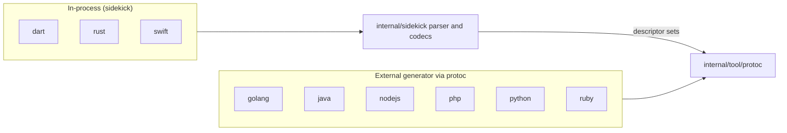

# Language integrations

Each supported language has a package under
[internal/librarian](/internal/librarian) that implements the hooks described
in [CLI and commands](/doc/architecture/cli-and-commands.md#the-implicit-language-contract).
This document describes every language with the same structure so they can be
compared: strategy and toolchain, the `Generate` steps, the configuration read,
post-processing, release behaviour, and tests. It ends with the shared tool
installers and the `postprocessing` package.

## At a glance

| Language | Generator | Installed by | Formatter | Writes `.repo-metadata.json` | Bump | Publish target | CI workflow |
| :--- | :--- | :--- | :--- | :---: | :---: | :--- | :--- |
| Dart | sidekick (`internal/sidekick/dart`) | nothing (Dart SDK on `PATH`) | `dart format` (twice) | | x | pub.dev (`dart pub publish`) | `dart.yaml` |
| Go | `protoc` + `protoc-gen-go`, `protoc-gen-go-grpc`, `protoc-gen-go_gapic` | `go install` into `go_tools` | `goimports` | x | x | release-please + Go module proxy (outside Librarian) | `go.yaml` |
| Java | `protoc` + `protoc-gen-java_gapic`, `protoc-gen-java_grpc`, `--java_out` | `internal/tool/maven` into `java_tools` | `google-java-format` | x | | Maven Central (outside Librarian) | `java.yaml` |
| Node.js | `gapic-generator-typescript` (drives `protoc` itself) | `internal/tool/pnpm` into `nodejs_tools` | inside the Node tools | x | | npm via release-please (outside Librarian) | `nodejs.yaml` |
| PHP | `protoc` + `gapic-generator-php` plugin, `--php_out` | `internal/tool/composer`, `pip`, `pnpm` into `php_tools` | `prettier` with the PHP plugin | | | Packagist (outside Librarian) | `php.yaml` |
| Python | `protoc` + `protoc-gen-python_gapic` | `internal/tool/pip` (plus embedded templates in `python_tools`) | `nox -s format` | x | x | PyPI via release-please (outside Librarian) | `python.yaml` |
| Ruby | `protoc` + `gapic-generator-ruby`, gRPC plugin, `--ruby_out` | `internal/tool/gem` into `ruby_tools` | none (TODO) | | | RubyGems via release-please (outside Librarian) | `ruby.yaml` |
| Rust | sidekick (`internal/sidekick/rust`, `rust_prost`) | `cargo install --locked` | `taplo fmt`, `cargo fmt` | x | x | crates.io (`cargo workspaces publish`) | `sidekick.yaml` |
| Swift | sidekick (`internal/sidekick/swift`) + `protoc --swift_out` | `git clone` + `swift build` into `swift_tools` | `swift-format` | x | x | per-package GitHub repositories `googleapis/swift-NAME` | `sidekick.yaml` |

Conventions shared by every package:

-   `Generate(ctx, cfg *config.Config, lib *config.Library, srcs *sources.Sources) error`
    is the main entry point. External-generator languages run their tools
    through `internal/tool/protoc.RunOrSystem` (the pinned `protoc` from
    `tools.protoc`, or the one on `PATH`) with the language's tool directory
    prepended to `PATH`. In-process languages build a `parser.ModelConfig`
    and call `parser.CreateModel`, passing `cfg.Tools.Protoc` through so the
    sidekick parser can produce descriptor sets.
-   Tool directories live under `cache.BinDirectory()` (`$LIBRARIAN_BIN`,
    default `~/.cache/librarian/bin`): `go_tools`, `java_tools`,
    `nodejs_tools`, `php_tools`, `python_tools`, `ruby_tools`,
    `swift_tools`, `protoc/vVERSION`.
-   Every subprocess goes through `internal/command`, so `-v` prints the
    exact command lines. Tests intercept tools by putting fake scripts on
    `PATH` and use `testhelper.RequireCommand` to skip when a real tool is
    missing.
-   Generated output is cleaned before generation according to `keep`; see
    the `Clean` row in the contract table.

## Dart

**Strategy and toolchain.** In-process. `internal/librarian/dart` is a thin
layer (977 lines) over the sidekick Dart codec. It needs `dart` (and for
releases `dart-apitool`) on `PATH`; `Install` is a no-op.

**Generate, step by step** ([generate.go](/internal/librarian/dart/generate.go),
[codec.go](/internal/librarian/dart/codec.go)):

1.  `toModelConfig` builds a `parser.ModelConfig` from the single API: only
    `protobuf` specs are accepted; `schema/google/showcase/v1beta1` switches
    the root to the showcase source. Every `Dart` option is flattened into
    the codec string map (`issue-tracker-url`, `api-keys-environment-variables`,
    `dependencies`, `dev-dependencies`, `extra-imports`, `part-file`,
    `prefixes`, `packages`, `protos`, `supports-sse`, README text, ...).
1.  `parser.CreateModel`, then `sidekickdart.Generate(ctx, model, lib.Output, codec)`
    renders `pubspec.yaml`, `LICENSE`, `README.md`, `.gitattributes`,
    `lib/<name>.dart`, `lib/src/api.g.dart`, `lib/src/version.dart`,
    `lib/testing.dart` and agent `skills/*/SKILL.md`, and runs `dart format`.
1.  `Format` runs `dart format <output>` a second time.

**Configuration it reads.** `Library.{output, apis[0].path, roots,
specification_format, copyright_year, version}`, every field of
`DartPackage`, `Default.Dart` (merged by `fillDart`), `tools.protoc`,
`Default.tag_format`.

**Post-processing and metadata.** None beyond formatting; no
`.repo-metadata.json`.

**Release.** `Bump` ([bump.go](/internal/librarian/dart/bump.go)) supports
`--all` only: `dart pub deps --json` builds a dependency graph, which is
sorted topologically; for each package it compares the pub.dev version
(`https://pub.dev/api/packages/NAME`) with `lib.Version`, checks git changes
since the tag from `tag_format`, and asks
`dart-apitool diff --old pub://NAME --new DIR` for the required bump, falling
back to a patch bump. It rewrites `pubspec.yaml`, `lib/src/version.dart`,
prepends a `CHANGELOG.md` entry from `git log`, updates dependents'
constraints and `Default.Dart.Packages`. `Publish`
([publish.go](/internal/librarian/dart/publish.go)) walks the same graph,
runs the API diff as a semver check and `dart pub publish --skip-validation`
(`--dry-run` or `--force`).

**Tests and CI.** Fake `dart` and `dart-apitool` scripts, an `httptest`
pub.dev, real temporary git repositories, golden directories under
`testdata/bump`. `dart.yaml` runs coverage over `internal/sidekick/dart` and
`internal/librarian/dart` with Dart 3.9 installed; there is no end-to-end
generation job.

## Go

**Strategy and toolchain.** External. `internal/librarian/golang` (2,076
lines) drives `protoc` with `protoc-gen-go`, `protoc-gen-go-grpc` and
`protoc-gen-go_gapic` (gapic-generator-go). `Install` runs
`go install NAME@VERSION` for each `tools.go` entry with
`GOBIN=<bin>/go_tools`.

**Generate, step by step** ([generate.go](/internal/librarian/golang/generate.go)):

1.  Create a temporary directory inside the output. Preview libraries (output
    under `preview/internal`) read protos from `<googleapis>/preview`.
1.  Per API, `generateAPI` runs
    `protoc --experimental_allow_proto3_optional --go_out=TMP -I=GOOGLEAPIS --go-grpc_out=TMP --go-grpc_opt=require_unimplemented_servers=false [--go_gapic_out=TMP --go_gapic_opt=...] API/*.proto NESTED`.
    GAPIC options include `go-gapic-package=cloud.google.com/go/IMPORT;PKG`,
    `metadata`, `rest-numeric-enums`, `diregapic`, generator features,
    `api-service-config`, `grpc-service-config`, `transport` and
    `release-level` (from `serviceconfig`).
1.  `moveGeneratedFiles` moves the client package and its snippets into the
    library (`filesystem.MoveAndMerge`) and rewrites snippet metadata
    versions (`snippetmetadata.UpdateAllLibraryVersions`).
1.  `generateInternalCopies` ([internalcopy.go](/internal/librarian/golang/internalcopy.go))
    runs a second `protoc` pass with `--descriptor_set_out`, rewrites the
    descriptor set in Go (import paths, packages), then a third pass with
    `--descriptor_set_in` and the configured plugin.
1.  Writes `internal/version.go` and the client `version.go` from embedded
    templates (with `license.Header`), `.repo-metadata.json`
    (`repometadata`), `README.md` (unless kept), deletes
    `go.delete_generation_output_paths`, then `go mod init` (first time) and
    `go mod tidy` with `GOTOOLCHAIN` from `Default.Go.Toolchain`.
1.  `Format` runs `goimports -w` over the output and snippet directories.

**Configuration it reads.** `Library.{name, version, output, apis, keep,
copyright_year, title_override, preview}`, `GoModule.{module_path_version,
nested_module, delete_generation_output_paths}`, `GoAPI.{import_path,
client_package, proto_only, no_metadata, no_snippets, diregapic,
enabled/disabled_generator_features, nested_protos, proto_api_level,
proto_package, internal_copies}`, `Default.Go.{toolchain,
default_enabled_generator_features}`, `tools.{go, protoc}`.

**Post-processing and metadata.** File moves, snippet metadata, license
headers, templated README and version files, `go mod tidy`, `goimports`.
`Clean` deletes generated files by exact name and suffix (`.pb.go`,
`_client.go`, example tests, `doc.go`, `gapic_metadata.json`, ...).

**Release.** `Bump` rewrites `const Version` in `internal/version.go` and the
snippet metadata; `libraryChanged` ignores the nested module directory.
`ReleasePleaseExtraFiles` adds the snippet metadata JSON paths to the
release-please config. No publish step.

**Tests and CI.** Real-tool tests gated by `RequireCommand` for `protoc` and
the three plugins against `internal/testdata/googleapis`. `go.yaml` checks
out `google-cloud-go`, runs `librarian install`, unit coverage of the package,
a smoke `librarian generate secretmanager`, and `generate --all` after merge.

## Java

**Strategy and toolchain.** External. `internal/librarian/java` (3,621 lines,
the largest integration) runs `protoc` three times per API with
`--java_out`, `--java_grpc_out` and `--java_gapic_out`. `Install` requires
`java` and `mvn` on `PATH` and delegates to `internal/tool/maven`, which
fetches artifacts with `mvn dependency:get` (or builds a local checkout) and
writes wrapper scripts into `java_tools/bin`.

**Generate, step by step** ([generate.go](/internal/librarian/java/generate.go),
[postprocess.go](/internal/librarian/java/postprocess.go)):

1.  Refuse to run if `java.group_id` is still the placeholder written by
    `add`. Write `.repo-metadata.json` first.
1.  Per API: `--java_out=OUT/API/proto`, `--java_grpc_out=OUT/API/grpc`
    (skipped for REST-only transports) and
    `--java_gapic_out=metadata:OUT/API/gapic --java_gapic_opt=...` with
    `repo`, `artifact=GROUP:ARTIFACT`, service, GAPIC and gRPC configs,
    `transport`, `rest-numeric-enums`, `generate-version-java`.
1.  `postProcessAPI`: unzip `temp-codegen.srcjar`, add license headers where
    missing (or `alternate_headers`), copy `copy_files`, restructure the
    staging tree into `proto-ARTIFACT`, `grpc-ARTIFACT` and the GAPIC module
    (or a monolithic `src/`), copy `.proto` sources, generate
    `clirr-ignored-differences.xml`, delete the staging directory.
1.  `postProcessLibrary`: `postprocessing.Apply(outDir, lib.Postprocess)`
    (the only caller of `internal/postprocessing`), render `README.md` from
    the embedded template and `.readme-partials.yaml`, `syncPOMs` (write
    missing module POMs from templates, update client/BOM/parent POMs between
    generated markers).
1.  After all libraries: `Format` runs `google-java-format --replace` in
    batches of at most 2,000 files, then `PostGenerate` regenerates the root
    `pom.xml` and `gapic-libraries-bom/pom.xml` from every module found in
    the repository.

**Configuration it reads.** `cfg.Repo`, `Library.{name, version, output,
apis, keep, postprocess, roots}`, all of `JavaModule` (group and artifact
IDs, released version, metadata overrides, `excluded_poms`,
`skip_pom_updates`, `transport_override`, ...), `JavaAPI.{samples,
generate_gapic, generate_proto, generate_grpc, generate_resource_names,
monolithic, omit_common_resources, additional_protos, excluded_protos,
copy_files}`, `Default.Java.{custom_group_ids, libraries_bom_version,
min_java_version}`, `tools.{maven, protoc}`.

**Post-processing and metadata.** The most elaborate: unzip, headers,
restructuring, clirr files, declarative `postprocess`, README, POM sync, root
POM and BOM. `Clean` removes module globs and any `.java` file carrying the
generator markers while preserving `pom.xml` and clirr files.

**Release.** No `Bump` or `Publish`. `Add` writes `0.1.0-SNAPSHOT`, appends a
line to `versions.txt`, and `Fill` derives `released_version` from it;
`ResolveMixinDependencies` adds mixin protos to `additional_protos`.
`Validate` requires `libraries_bom_version` and consistent versions.

**Tests and CI.** `runProtoc` is a package variable swapped in tests; goldens
in `testdata/{postgenerate,readme,syncpoms}`. `java.yaml` sparse-checks-out
`google-cloud-java`, installs Java 17 and Maven, verifies the wrappers, runs
coverage, a smoke `librarian generate secretmanager`, and `generate --all`
after merge.

## Node.js

**Strategy and toolchain.** External. `internal/librarian/nodejs` (1,293
lines) runs `gapic-generator-typescript`, which invokes `protoc` itself, then
`gapic-node-processing` and `compileProtos`. `Install` delegates to
`internal/tool/pnpm` (`pnpm add -g`, or a GitHub source build) into
`nodejs_tools/bin`.

**Generate, step by step** ([generate.go](/internal/librarian/nodejs/generate.go)):

1.  Require `nodejs.package_name` and the cached tools. The repository root
    is two levels above the output.
1.  Per API, in the googleapis directory:
    `gapic-generator-typescript --protoc=PROTOC --common-proto-path=. -I . --output-dir REPO/.librarian-staging/LIB/N_API [--grpc-service-config] [--service-yaml] --package-name NAME --metadata [--transport] [--rest-numeric-enums] [--diregapic] [--bundle-config] [--format=esm] [--handwritten-layer] [--main-service] [--mixins] PROTOS`.
    Protos come from `proto.Gather` plus `common_resources.proto` and
    `additional_protos`, minus `exclude_protos`.
1.  `runPostProcessor`: back up `keep` files, run
    `gapic-node-processing combine-library --source-path STAGING --destination-path OUT --default-version V [--is-esm]`,
    restore kept files, copy samples, remove `.OwlBot.yaml`, restore the
    original copyright year in `src/` and `test/`, write
    `.repo-metadata.json`, copy protos listed in `*_proto_list.json`, run
    `compileProtos src --no-comments` (or the ESM variant), run
    `node librarian.js` if the library ships one, render `README.md`.
1.  No `Format` hook; formatting happens inside the Node tools.

**Configuration it reads.** `Library.{name, output, apis, keep,
copyright_year}`, `NodejsPackage.{package_name, bundle_config, esm,
extra_protoc_parameters, handwritten_layer, main_service, additional_protos,
default_version, dependencies, metadata overrides}`, `NodejsAPI.{exclude_protos,
omit_common_resources, diregapic, mixins, additional_protos}`,
`Default.Nodejs.custom_package_prefixes`, `tools.{pnpm, protoc}`.

**Post-processing and metadata.** Staging and combine, copyright restore,
`.repo-metadata.json`, proto copies, `compileProtos`, README. `Clean` deletes
`protos/*.proto`, JSON under `src/`, generated `.js`/`.ts` files carrying the
generator marker, and a fixed list of root files.

**Release.** None in Librarian; `Add` writes version `0.0.0` and
`librarian add` syncs `release-please-config.json`. `IsMixedLibrary` is true
for a library with an `output` but no APIs.

**Tests and CI.** `LIBRARIAN_BIN` is redirected per test; real-tool tests
require the three Node tools; golden README under `testdata`. `nodejs.yaml`
installs Node 22 and pnpm, caches the tool directory, runs coverage, a smoke
`librarian generate google-cloud-secretmanager`, and `generate --all` after
merge.

## PHP

**Strategy and toolchain.** External. `internal/librarian/php` (1,213 lines)
runs `protoc` twice per API: once with the `gapic-generator-php` plugin and
once with `--php_out`, each producing a zip. `Install` requires `composer`
and `php` and uses three installers: `internal/tool/composer` (the generator
wrapper), `internal/tool/pip` (synthtool and owlbot) and `internal/tool/pnpm`
(`prettier`, `@prettier/plugin-php`, `php-post-processor`), all under
`php_tools`.

**Generate, step by step** ([generate.go](/internal/librarian/php/generate.go),
[postprocess.go](/internal/librarian/php/postprocess.go)):

1.  Require APIs, `output`, `protoc` and the wrapper. If the component
    directory does not exist, create it with
    `dev/google-cloud component:new ...` using the namespace read from the
    `php_namespace` proto option (`proto.Search`).
1.  Per API, with `GOOGLEAPIS_DIR` set:
    `protoc --plugin=protoc-gen-gapic=php_tools/bin/gapic-generator-php --gapic_out=OPTS:TMP/API-gapic.zip -I ROOTS PROTOS`
    (options `metadata`, `transport`, `rest-numeric-enums`,
    `generate-snippets`, `grpc_service_config`, `service_yaml`, `gapic_yaml`)
    and `protoc --php_out=TMP/API-proto.zip ...`.
1.  Unzip both archives into `owl-bot-staging/COMPONENT/STAGING_SUBDIR` and
    `.../proto/src` (`filesystem.Unzip`).
1.  `postProcessLibrary`: require `owlbot.py`, run
    `php-post-processor --input .` in each staging directory, restore the
    copyright year, run `python3 owlbot.py` in the library (which copies
    from staging), delete the staging tree.
1.  `Format` runs `prettier '**/Client/*' --write --parser=php --plugin=.../@prettier/plugin-php`.

**Configuration it reads.** `Library.{name, output, apis, roots, keep,
copyright_year}`, `PHPAPI.{staging_subdir, common_resources, generate_gapic,
samples, gapic_yaml, additional_protos, excluded_protos, proto_package}`,
`Default.PHP.common_resources`, `tools.{composer, pip, pnpm, protoc}`.

**Post-processing and metadata.** Delegated to the repository's own
tooling (`php-post-processor`, `owlbot.py`); no `.repo-metadata.json` is
written by Librarian. `Clean` removes `gapic_metadata.json` and `.php` files
whose first 50 lines contain the generator warning, then prunes empty
directories.

**Release.** None. `Add` writes `0.0.0`; `Validate` insists that
`common_resources` is set per API or in `Default.PHP`;
`ResolveMixinDependencies` adds mixin protos.

**Tests and CI.** Fake `owlbot.py` scripts in `testdata`; `DEVELOPMENT.md`
documents the local setup. `php.yaml` runs separate unit and smoke jobs with
PHP 8.2, Node and Python installed; smoke is `librarian generate secretmanager`.

## Python

**Strategy and toolchain.** External. `internal/librarian/python` (1,422
lines) runs `protoc` with `protoc-gen-python_gapic` into an `owl-bot-staging`
tree and then hands over to `synthtool` and `nox`. `Install` runs
`internal/tool/pip` for `tools.pip` and extracts the embedded
`templates/python_mono_repo_library` into `python_tools/templates`.

**Generate, step by step** ([generate.go](/internal/librarian/python/generate.go)):

1.  `prepareGenerationRoot` creates `<pkg>/tmp` with a symlink
    `tmp/packages/<pkg>` back to the package so synthtool sees a mono-repo
    layout. Preview libraries (output under `preview-packages`) read from
    `<googleapis>/preview`.
1.  Per API (longest path first), in the googleapis directory:
    `protoc --python_gapic_out=STAGING --python_gapic_opt=metadata,OPT_ARGS,rest-numeric-enums,transport=T,python-gapic-namespace=NS,python-gapic-name=N,warehouse-package-name=LIB,gapic-version=V,retry-config=...,service-yaml=... PROTOS`;
    proto-only APIs use `--python_out --pyi_out` and copy the `.proto` files.
1.  `createRepoMetadata` writes `.repo-metadata.json` (requires
    `python.default_version`).
1.  `runPostProcessor` copies
    `.librarian/generator-input/client-post-processing` into
    `scripts/client-post-processing`, runs
    `python3 -c "from synthtool.languages import python_mono_repo; python_mono_repo.owlbot_main(OUT)"`
    with `SYNTHTOOL_TEMPLATES=python_tools/templates`, then
    `nox -s format --no-venv --no-install`.
1.  Clean up the generation root and scripts, replace the `docs/README.rst`
    symlink with a copy, create `CHANGELOG.md` and its docs symlink.
1.  No `Format` hook (formatting is the `nox` step).

**Configuration it reads.** `Library.{name, version, output, apis, keep,
preview}`, `PythonPackage.{default_version, proto_only_apis,
opt_args_by_api, common_gapic_paths, library_type, metadata overrides}`,
`Default.Python.{common_gapic_paths, library_type, allowed_namespaces}`,
`cfg.Repo`, `tools.{pip, protoc}`.

**Post-processing and metadata.** `.repo-metadata.json`, synthtool, `nox`,
README and CHANGELOG plumbing, snippet metadata on bump. `Clean` removes
`services`, `types`, `__init__.py`, `gapic_version.py`,
`gapic_metadata.json`, `py.typed` from the versioned directories listed in
`common_gapic_paths`.

**Release.** `Bump` rewrites `__version__` in every `gapic_version.py` and
the snippet metadata under `samples/generated_samples`.
`ReleasePleasePkgPrefix` (`packages/`) and `ReleasePleaseExtraFiles` feed the
bulk and individual release-please configs that `librarian add` maintains.
`Add` validates the namespace against `allowed_namespaces`.

**Tests and CI.** Real-tool tests require `python3`, `nox`, `protoc` and the
plugin; slow integration tests are skipped by default. `python.yaml` installs
Python 3.14, sparse-checks-out `google-cloud-python` including `.librarian`,
runs coverage, a smoke `librarian generate google-cloud-secret-manager`, and
`generate --all` after merge.

## Ruby

**Strategy and toolchain.** External. `internal/librarian/ruby` (1,470 lines)
runs `protoc` with `--ruby_cloud_out` (gapic-generator-ruby), `--ruby_out`
and the gRPC Ruby plugin. `Install` requires `gem` and uses
`internal/tool/gem` to install into `ruby_tools` (`--bindir ruby_tools/bin
--install-dir ruby_tools`); at run time `GEM_HOME`, `GEM_PATH` and `PATH`
point there.

**Generate, step by step** ([generate.go](/internal/librarian/ruby/generate.go),
[multi_wrapper.go](/internal/librarian/ruby/multi_wrapper.go)):

1.  Create a temporary directory inside the output. A wrapper library with
    several APIs goes through `prepareMultiWrapper`, which stages the main
    gem and rewrites entrypoint, gemspec, RuboCop and YARD config, README
    and version files to cover the secondary gems.
1.  Per API:
    `protoc --experimental_allow_proto3_optional -I=GOOGLEAPIS --ruby_cloud_out=STAGING [--ruby_out=STAGING/lib --grpc_out=STAGING/lib --plugin=protoc-gen-grpc=ruby_tools/bin/grpc_tools_ruby_protoc_plugin] --ruby_cloud_opt=OPTS PROTOS`
    where the options include `ruby-cloud-gem-name`, `service-yaml`,
    description and summary, `grpc-service-config`,
    `ruby-cloud-generate-transports=grpc;rest`,
    `ruby-cloud-rest-numeric-enums=true` and every `ruby_cloud_opts` field.
1.  Delete `delete_generation_output_paths`, remove
    `common_resources_pb.rb`, merge the staging tree into the output with
    `filesystem.MoveAndMergeWithKeep`.
1.  Run each configured `toys` task in the output directory.
1.  `Format` is a no-op (tracked by an issue).

**Configuration it reads.** `Library.{name, output, apis, keep,
title_override}`, `RubyPackage.{wrapper_of, delete_generation_output_paths,
toys_tasks}`, `RubyAPI.{additional_protos, delete_generation_output_paths,
ruby_cloud_opts}`, `tools.{gem, protoc}`.

**Post-processing and metadata.** Deletions and `toys` tasks only. The
existing `.repo-metadata.json`, `CHANGELOG.md` and `version.rb` are always
kept; `Clean` removes the standard gem root files and the `lib`,
`proto_docs`, `snippets` and `test` directories.

**Release.** No `Bump` or `Publish`. `Add` writes `0.0.1` and turns an
unversioned API into a wrapper of the matching versioned gem;
`AddManifest`/`AddPackage` add the gem to the release-please manifest and
config with a `version_file` entry. `--name` on `librarian add` exists for
Ruby only.

**Tests and CI.** `LIBRARIAN_BIN`, `GEM_PATH` and `PATH` fakes. `ruby.yaml`
installs Ruby 4.0, prepends `ruby_tools/bin` to `PATH`, runs coverage, a
smoke `librarian generate google-cloud-asset-v1`, and `generate --all` after
merge.

## Rust

**Strategy and toolchain.** In-process. `internal/librarian/rust` (2,094
lines) drives the sidekick Rust codec and the prost hybrid, creates new
crates with `cargo new`, and uses `taplo`, `cargo fmt`, `cargo workspaces`
and `cargo semver-checks`. `Install` runs `cargo install --locked NAME@VERSION`
for each `tools.cargo` entry (`tidy` fails if a version is missing).

**Generate, step by step** ([generate.go](/internal/librarian/rust/generate.go),
[codec.go](/internal/librarian/rust/codec.go),
[generate_prost_hybrid.go](/internal/librarian/rust/generate_prost_hybrid.go)):

1.  `IsMixedLibrary` (modules configured, or no APIs and an output whose
    derived API path is not in `sdk.yaml`) routes to `generateVeneer`, which
    handles each `rust.modules[]` by `template`: `prost`/`tonic` →
    `rust_prost.Generate`; `storage` → `GenerateStorage`;
    `bigquery-builder` → `GenerateBigQueryBuilder`; anything else →
    `sidekickrust.Generate` with `template-override=templates/<template>`
    (`grpc-client`, `http-client`, `mod`, `grpc-mock`).
1.  Otherwise exactly one API: `libraryToModelConfig` resolves the service
    config with `serviceconfig.Find`, picks the spec source by
    `specification_format` (protobuf, Discovery or OpenAPI), and flattens
    `RustCrate` into the codec map (`package:NAME=...` dependency entries,
    rustdoc and clippy warnings, module path, features, transport,
    tracing, samples, name overrides, `keep` entries as `extra-modules`).
1.  `parser.CreateModel`; if the crate does not exist yet,
    `cargo new --vcs none --lib OUT` and `taplo fmt`.
1.  `sidekickrust.Generate` renders `Cargo.toml`, `README.md`, `src/lib.rs`,
    `src/model.rs` (+ `debug`, `serialize`, `deserialize`), `src/client.rs`,
    `src/builder.rs`, `src/stub.rs`, `src/stub/dynamic.rs`,
    `src/transport.rs`, `src/tracing.rs`.
1.  If `GrpcRootTypeIDs` is non-empty, `generateProstHybrid` filters the model
    to the gRPC root types (rejecting `google.protobuf.Any` unless allowed),
    renders `src/prost` through `rust_prost` (which builds a temporary crate
    with `cargo build --features _generate-protos` and `protoc`) and renders
    `src/convert.rs` with the `convert-prost` templates.
1.  Write `.repo-metadata.json` when the crate has services; for a new crate
    run `cargo fmt`, `cargo test`, `cargo doc --no-deps` (with
    `RUSTDOCFLAGS=-D warnings`) and `cargo clippy -- --deny warnings`.
1.  After all libraries: `Format` (`taplo fmt OUT/Cargo.toml`,
    `cargo --frozen fmt -p NAME`), `writeDocIndex` (`_libraries.json`), and
    `UpdateWorkspace` (`cargo update --workspace`).

**Configuration it reads.** `Library.{name, version, output, apis, roots,
keep, copyright_year, specification_format, skip_release}`, everything in
`RustCrate` and `RustModule`, `Default.Rust.package_dependencies`,
`tools.{cargo, protoc}`, the googleapis and showcase sources.

**Post-processing and metadata.** `.repo-metadata.json` (docs.rs link),
formatting, workspace update. `Keep` makes veneer libraries keep everything
outside module outputs; `Clean` is the shared keep-rule cleaner.

**Release.** `Bump` checks `git diff LAST_TAG..HEAD -- Cargo.toml` to avoid
double bumps, then rewrites the crate version in `Cargo.toml`, the README
and the workspace manifest. `Publish`
([publish.go](/internal/librarian/rust/publish.go)): preflight (`git`
version and remote, `cargo --version`, reinstall `tools.cargo`), find the
crates changed since the last tag and not marked `publish = false`, compare
with `cargo workspaces plan --skip-published`, run
`cargo semver-checks --all-features -p NAME` for crates already on
crates.io, then `cargo publish --dry-run` or
`cargo workspaces publish --skip-published --publish-interval=60 --no-git-commit --from-git skip`.
`ResolveDependencies` (used by `add`) maps external proto packages to other
crates in `librarian.yaml` and appends `package_dependencies`.

**Tests and CI.** `RequireCommand` for `protoc`, `cargo`, `taplo`, `rustfmt`,
`git`. No `rust.yaml`: `sidekick.yaml` installs stable Rust and taplo, runs
coverage over `internal/sidekick/...`, `internal/librarian/rust` and
`internal/librarian/swift`, and after merge checks out `google-cloud-rust`,
runs `librarian generate --all` and `cargo check -p google-cloud-showcase-v1beta1`.

## Swift

**Strategy and toolchain.** In-process. `internal/librarian/swift` (2,084
lines) drives the sidekick Swift codec, compiles raw protobuf modules with
`protoc --swift_out`, formats with `swift-format` and publishes by splitting
git history. `Install` requires `swift` 6.2 or newer, `swift-format` and
`git`; for each `tools.swift` entry it runs
`git clone --depth 1 --branch VERSION REPO`, `swift build -c release [--product P]`
and copies the binary into `swift_tools/bin`.

**Generate, step by step** ([generate.go](/internal/librarian/swift/generate.go),
[generate_module.go](/internal/librarian/swift/generate_module.go)):

1.  `ResolveDependencyVersions` fills `swift.dependencies[].{path, version}`
    from the other libraries in `librarian.yaml` or
    `Default.Swift.default_version`.
1.  A library with `swift.modules` is mixed: each module is handled by
    `module_type`: `package-version` → `GenerateVersion`
    (`PackageVersion.swift`); `swift-protobuf` → `compileProtobufs`
    (`protoc --swift_out=Visibility=Public:OUT -I ROOTS PROTOS` with
    `swift_tools/bin` on `PATH` for `protoc-gen-swift`); `convert-swift` →
    `GenerateConversions`; `storage` → `GenerateStorage` for the two storage
    APIs; default or `grpc-client` → `sidekickswift.Generate` in module mode
    (messages, enums, stubs, LRO converter).
1.  Otherwise exactly one API: `libraryToModelConfig` (service config,
    showcase special case, `include_list`, `included_ids`, `skipped_ids`,
    Discovery pollers) → `parser.CreateModel` →
    `sidekickswift.Generate(ctx, model, lib.Output, lib, nil)`, which writes
    `Package.swift`, `README.md`, `.spi.yml`, one Swift file per message,
    enum, service, stub, transport, logging and retry type, `Clients.swift`
    or `PackageVersion.swift`, quickstart and per-method snippets, and a
    DocC index.
1.  Write `.repo-metadata.json` (Swift Package Index documentation link).
1.  `Format` runs `swift-format format --in-place --recursive` over the
    library and module outputs; `writeDocIndex` runs after all libraries.

**Configuration it reads.** `Library.{name, version, output, apis, roots,
specification_format, skip_release}`, all of `SwiftPackage`
(`dependencies`, `modules`, `per_service_traits`, `default_traits`,
`lro_any_converter`, name overrides, Discovery pollers, ...),
`Default.Swift.{dependencies, default_version}`, `Default.output`, `cfg.Repo`
(GitHub organisation), `tools.{protoc, swift}`.

**Post-processing and metadata.** `.repo-metadata.json` and formatting; the
codec owns the file layout. `Clean` is the shared keep-rule cleaner.

**Release.** `Bump` looks for `Clients.swift` or `PackageVersion.swift`
under `Sources`, skips if `git log -p LAST_TAG..HEAD` shows the version
already changed, otherwise sets `lib.Version` (the file is rewritten on the
next generation). `Publish` ([publish.go](/internal/librarian/swift/publish.go),
[split.go](/internal/librarian/swift/split.go)) selects versioned,
releasable libraries, builds a dependency graph with
`swift package dump-package`, and works in topological levels: skip packages
whose tag already exists on the remote, split each package's history
(`git rev-list` → `git ls-tree` → `git mktree` → `git commit-tree`, following
`pkgs/`→`packages/` renames and adding root files such as `LICENSE`), then
`git push` branch and tag to `git@github.com:ORG/swift-NAME.git`. Dry runs
log instead of pushing.

**Tests and CI.** `RequireCommand` for `git`, `protoc`, `protoc-gen-swift`,
`swift-format`; fake `swift` scripts for the installer. Coverage runs in
`sidekick.yaml`; there is no Swift end-to-end generation job in CI.

## Tool installers (`internal/tool`)

| Package | Installs | How | Where |
| :--- | :--- | :--- | :--- |
| `protoc` | A pinned `protoc` release | `fetch.Download` of `protoc-VERSION-OS-ARCH.zip` from GitHub releases, SHA-256 from `tools.protoc.sha256_by_platform` (or `sha256` for linux-x86_64), `filesystem.Unzip`. `RunOrSystem` falls back to the `protoc` on `PATH`. | `<bin>/protoc/vVERSION/bin/protoc` |
| `maven` | Java generator jars and wrappers | `mvn dependency:get -Dartifact=G:A:V:EXT[:CLASSIFIER]`, copy from `~/.m2`, write a `bin` wrapper (`exec java -jar`, `-cp MAIN`, or direct exec); `local_path` tools are built with `mvn package -pl PATH --also-make`. | `java_tools/{bin,lib}` |
| `pip` | Python packages | `pip install NAME==VERSION` (or `--force-reinstall` for `git+` URLs); `local_path` must exist. No private environment: installs wherever `pip` points. | the active Python |
| `pnpm` | Node packages | `pnpm add -g PKG` with `PNPM_HOME` and global dirs under the cache; tools with `build` steps are fetched with `fetch.Repo` and built with `sh -c`. | `nodejs_tools/bin` or `php_tools/bin` |
| `composer` | PHP tools from a git repository or local path | `fetch.Repo` (or `local_path`), `composer install --no-interaction --prefer-dist`, a PHP launcher script for `entrypoint`. | `php_tools/bin` |
| `gem` | Ruby gems | `gem install NAME -v VERSION --bindir BIN --install-dir DIR --no-document`. | `ruby_tools`, `ruby_tools/bin` |

Go (`go install` with `GOBIN`), Rust (`cargo install --locked`) and Swift
(`git clone` + `swift build`) implement installation inside their language
package; Dart installs nothing.

## The `postprocessing` package

[internal/postprocessing](/internal/postprocessing) implements the
declarative `postprocess:` block of a library. `Apply(outDir, cfg)` runs
`copy_file`, then `remove_file`, `replace`, `replace_regex` (patterns get an
implicit `(?m)`) and finally `method_operations`. Paths are globs relative to
the output (`*` only, and a pattern that matches nothing is an error). The
method operations (`delete`, `copy_and_rename`, `deprecate`) work on Java
sources by matching the full single-line method signature and balancing
braces on a comment-stripped copy of the file; `deprecate` adds
`@Deprecated` and a Javadoc tag. Java is the only caller today, so adding
`postprocess:` to a library in another language has no effect.

## See also

-   [Architecture overview](/doc/architecture/README.md)
-   [CLI and commands](/doc/architecture/cli-and-commands.md)
-   [Sidekick generation engine](/doc/architecture/sidekick.md)
-   [CI and integration](/doc/architecture/ci-and-integration.md)
