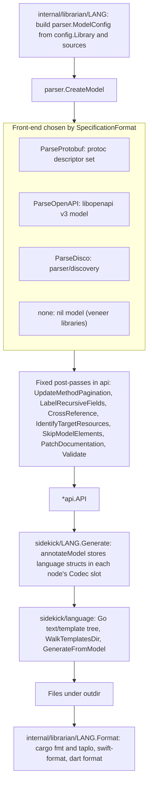
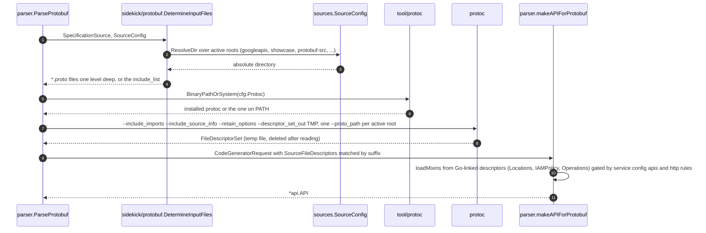

# Sidekick generation engine

Sidekick is the in-process code generator under
[internal/sidekick](/internal/sidekick). It turns an API specification
(protobuf, OpenAPI v3 or a Discovery document) into a language-neutral model,
lets a language *codec* annotate that model, and renders Go templates into
source files. Today it generates Dart, Rust and Swift; the other languages use
external generators (see [Language integrations](/doc/architecture/languages.md)).

[internal/sidekick/AGENTS.md](/internal/sidekick/AGENTS.md) is the normative
guide for working in this tree (architecture rules, template style, testing
rules). This document describes what the code does at the snapshot commit.

## Pipeline

The four stages map onto packages as follows.

| Stage | Package | Entry points |
| :--- | :--- | :--- |
| Parse | [parser](/internal/sidekick/parser), [parser/discovery](/internal/sidekick/parser/discovery), [parser/httprule](/internal/sidekick/parser/httprule), [parser/svcconfig](/internal/sidekick/parser/svcconfig), [protobuf](/internal/sidekick/protobuf) | `parser.CreateModel(*parser.ModelConfig) (*api.API, error)` |
| Model | [api](/internal/sidekick/api) | node types, `CrossReference`, `Validate`, `SkipModelElements`, ... |
| Annotate and render | [rust](/internal/sidekick/rust), [rust_prost](/internal/sidekick/rust_prost), [swift](/internal/sidekick/swift), [dart](/internal/sidekick/dart), [codec_sample](/internal/sidekick/codec_sample) | each exports `Generate(ctx, *api.API, outdir, ...)` |
| Template engine | [language](/internal/sidekick/language) | `MustParseTemplates`, `WalkTemplatesDir`, `Templates.GenerateFromModel`, `Templates.Validate` |
| Format | `internal/librarian/{rust,swift,dart}` | `Format`; Dart also formats inside the codec |

## The API model

`api.API` is the root of an in-memory tree. Every parser produces it and
every codec consumes it; it is a leaf package with no dependencies inside the
module.

| Node | Key fields | `Codec` slot |
| :--- | :--- | :---: |
| `API` | `Name`, `PackageName`, `Title`, `Description`, `Services`, `Messages`, `Enums`, `ResourceDefinitions`, `QuickstartService`, file-option overrides (`RubyPackage`, `PhpNamespace`, `CsharpNamespace`), private ID indices | yes |
| `Service` | `Name`, `ID`, `Documentation`, `Methods`, `DefaultHost`, `Package`, `Model`, `QuickstartMethod` | yes |
| `Method` | `Name`, `ID`, `InputType`, `OutputType`, `PathInfo`, `Pagination`, streaming flags, `OperationInfo`, `DiscoveryLro`, `Routing`, `AutoPopulated`, `Signatures`, AIP classification flags (`IsSimple`, `IsLRO`, `IsList`, `IsAIPStandardGet`, ...), `SampleInfo` | yes |
| `SampleInfo` | fields chosen for quickstart samples | yes |
| `Message` | `Name`, `ID`, `Fields`, `OneOfs`, nested `Messages` and `Enums`, `Parent`, `IsMap`, `Pagination`, `Resource`, `SyntheticRequest`, `ServicePlaceholder` | yes |
| `Field` | `Name`, `ID`, `Typez`, `TypezID`, `JSONName`, `Optional`, `Repeated`, `Map`, `Behavior`, `Group` (oneof), `MessageType`, `EnumType`, `ResourceReference`, `AutoPopulated`, `Recursive` | yes |
| `Enum`, `EnumValue` | `Name`, `ID`, `Values`, `UniqueNumberValues`, `ValuesForExamples` / `Number`, `Parent` | yes |
| `OneOf` | `Name`, `ID`, `Fields`, `ExampleField` | yes |
| `OperationInfo` | `MetadataTypeID`, `ResponseTypeID`, `Method` | yes |
| `Resource`, `ResourceReference` | `Type`, `Patterns`, `Plural`, `Singular` / `Type`, `ChildType` | yes |
| `PathInfo`, `PathBinding` | `Bindings`, `BodyFieldPath` / `Verb`, `PathTemplate`, `QueryParameters`, `TargetResource` | yes |
| `RoutingInfoVariant`, `DiscoveryLro` | routing header specs / polling path parameters | yes |
| `PathTemplate`, `PathSegment`, `PathVariable`, `MethodSignature`, `PaginationInfo`, `RoutingInfo`, `TargetResource`, `Discovery`, `Poller` | structural helpers | no |

Sixteen node types carry a `Codec any` field. A codec stores its own struct
there during annotation, and templates reach it as `.Codec.<Field>`; enclosing
annotations are reachable through back-pointers (`Method.Service`,
`Field.Parent`, `Service.Model`) or `API.ModelCodec()`.

The post-passes run by `CreateModel`, in order:

| Pass | Effect |
| :--- | :--- |
| `UpdateMethodPagination` | Detects AIP-4233 pagination (`page_token` request field, `next_page_token` plus a repeated or map item in the response), honouring `PaginationOverride`s from configuration. |
| `LabelRecursiveFields` | Marks fields whose type contains the enclosing message. |
| `CrossReference` | Replaces IDs with pointers (`Field.MessageType`, `Method.InputType`, ...), then `enrichSamples`: AIP standard-method classification, LRO and streaming flags, example enum values, quickstart service and method selection. |
| `IdentifyTargetResources` | Fills `PathBinding.TargetResource` from `resource_reference` annotations, optionally with a name heuristic. |
| `SkipModelElements` | Applies `included_ids` (keep the reachable closure) or `skipped_ids`; fails if a skipped field drives pagination or a method signature. |
| `PatchDocumentation` | Applies `documentation_overrides` (ID, match, replace). |
| `Validate` | Every top-level element must share `PackageName`, except the Locations, IAM and Operations mixin packages. |

Two things about `api` surprise newcomers: `All*()` accessors iterate Go maps
and are unordered, so parsers sort the slices they expose; and
[test.go](/internal/sidekick/api/test.go) ships fluent `NewTest*`/`With*`
builders in the production package because tests in other packages need them.
AGENTS.md forbids calling them outside tests.

## The parser

`parser.ModelConfig` is the only input: `SpecificationFormat`,
`SpecificationSource` (an API directory such as
`google/cloud/secretmanager/v1`, or a document path), `Source`
(`*sources.SourceConfig` with the active roots), `Protoc` (the pinned protoc
configuration), `ServiceConfig`, a free-form `Codec map[string]string`,
`CommentOverrides`, `PaginationOverrides`, `Discovery` (LRO pollers for
Discovery APIs), `ResourceNameHeuristic`, `MessageModuleNameOverrides` and
`Override` (name, title, description, included and skipped IDs).

| Format | Entry | How it works |
| :--- | :--- | :--- |
| `protobuf` | `ParseProtobuf` → `makeAPIForProtobuf` | Builds a `CodeGeneratorRequest` by running `protoc` (below) or by reading precompiled descriptor sets (`DescriptorFiles`, tests only). Reads the service config for name, title, description and package. Two-phase symbol table: every file in the descriptor set (including imports and mixins) is indexed; only the target files contribute to `Messages`, `Enums` and `Services`. Extracts `google.api.http` (with additional bindings and an AIP-127 body check), `google.api.routing`, `google.api.method_signature`, `google.longrunning.operation_info`, `google.api.default_host`, `api_version`, `field_behavior`, `field_info` (UUID4 auto-population, confirmed against `publishing.method_settings`), and resource annotations. Attaches leading comments from `SourceCodeInfo`. |
| `openapi` | `ParseOpenAPI` → `makeAPIForOpenAPI` | `libopenapi` v3 model. One message per `components.schemas`, one synthetic service, one method per path and verb named by `operationId`, with a synthetic request message holding path and query parameters and a `body` field. Only `application/json` bodies and `default` responses are supported. Maps become `$map<string, T>` messages in the reserved package `$`. |
| `discovery` | `ParseDisco` → `discovery.NewAPI` | Custom JSON decoding that preserves key order. One message per schema, string enums become nested enums, `additionalProperties` become maps, one service per resource (recursive), RFC 6570 URI templates prefixed with `servicePath`, `parameterOrder` becomes a method signature. LRO pollers come from `librarian.yaml` (`discovery.operation_id`, `pollers`). Media upload methods are rejected. |
| `none` | `CreateModel` | Returns a nil model; used by libraries that only contain hand-written code. |

### How protobuf descriptors are obtained

Notes:

-   `runProtoc` is one of the few places that uses `os/exec` directly rather
    than `internal/command`.
-   Mixins are never compiled by `protoc`. Their descriptors come from the Go
    packages linked into the binary (`genproto`, `longrunningpb`, `iampb`) via
    `protodesc.ToFileDescriptorProto`. Which mixin *services* load depends on
    the service config `apis[]` list; which mixin *methods* are emitted
    depends on `http.rules[].selector`; `GetOperation` is always added when a
    method returns `google.longrunning.Operation`.
-   `--retain_options` keeps the custom options so the annotation extensions
    can be read back with `proto.GetExtension`.
-   The annotation extension descriptors are aliased in
    [protobuf_imports_oss.go](/internal/sidekick/parser/protobuf_imports_oss.go)
    (`//go:build !google3`) and `protobuf_imports_google3.go`
    (`//go:build google3`) so the same parser compiles against either set of
    generated packages. New code must use those aliases rather than importing
    `genproto` or `iampb` directly ([AGENTS.md](/AGENTS.md)).

## The template engine

[internal/sidekick/language](/internal/sidekick/language) wraps Go
`text/template`. It is the only template engine in the repository: there are
no Mustache files or dependencies at the snapshot commit, even though
`internal/sidekick/AGENTS.md` and some `api` doc comments still describe a
migration away from Mustache.

| Mechanism | Rule |
| :--- | :--- |
| Embedding | Each codec declares `//go:embed all:templates` and a package-level `parsedTemplates = language.MustParseTemplates(templates)`, so a template syntax error panics at process start. |
| Template names | The path minus `.gotmpl`, for example `templates/common/prologue`. |
| Output files | `WalkTemplatesDir(fsys, root)`: a basename with more than one dot (`lib.rs.gotmpl`) is an output file written to `<dir relative to root>/<basename minus .gotmpl>`; a single-dot name (`prologue.gotmpl`) is a partial and is skipped. |
| Partials | `{{- include "templates/common/prologue" . }}` executes another template and returns its text (prefixed with a newline, hence the leading `-`); pipe through `indent N` to nest. |
| Strictness | `missingkey=error`; `Templates.Validate()` is an AST lint that rejects variable mutation, `break`/`continue`, computational built-ins (`printf`, `len`, `index`, `eq`, `and`, ...) and method calls with arguments. Codecs call it from a `TestValidateTemplates`. |
| Rendering | `GenerateFromModel(outDir, model, files)` renders model-rooted templates; `GenerateElement`/`GenerateService`/`GenerateMessage`/`GenerateEnum` render one node per file. Files are written with `MkdirAll(0o755)` and `WriteFile(0o666)`. |

The intent behind the lint is that templates only *present* data: anything
computed belongs in the annotation structs, where it can be unit tested.
The same package also provides `PathParams`, `QueryParams`, `FilterSlice`,
`MapSlice` helpers and `ExtractCrossReferenceLinks`, which finds AIP-192
`[Title][pkg.Name]` links in Markdown comments with goldmark.

## How a codec plugs in

There is no Go interface for codecs. The contract is a convention shared by
`codec_sample`, `rust`, `swift`, `dart` and `rust_prost`:

1.  A package `internal/sidekick/<lang>` with an embedded `templates/` tree
    and `parsedTemplates` at package scope.
1.  An exported `Generate(ctx, model *api.API, outdir string, ...) error`.
    The trailing parameters differ per codec, and the matching
    `internal/librarian/<lang>` package adapts:

    | Codec | Trailing parameters |
    | :--- | :--- |
    | `codec_sample` | `*config.Library` |
    | `rust` | `*parser.ModelConfig` (options arrive as the `Codec` string map; unknown keys are an error) |
    | `rust_prost` | `template string, *parser.ModelConfig` |
    | `swift` | `*config.Library, *config.SwiftModule` (typed, no string map) |
    | `dart` | `map[string]string` (unknown keys ignored; `issue-tracker-url` required) |

1.  A private `codec` struct and an `annotateModel` driver that walks
    messages (recursively), enums and services, assigning a language-specific
    struct to each node's `Codec` slot. AGENTS.md asks for one
    `annotate_<node>.go` per node type with a paired test; `swift` and
    `codec_sample` follow this, `rust` mostly does, `dart` keeps everything in
    one file.
1.  A file manifest from `WalkTemplatesDir` (name-encoded outputs) or built by
    hand for per-element files (Swift writes one file per message, enum and
    service).
1.  Rendering through `parsedTemplates.GenerateFromModel` or
    `GenerateElement`.
1.  Tests: `TestValidateTemplates`, per-node annotation tests built with
    `api.NewTest*`, and generation tests that run the real parser on
    [internal/testdata/googleapis](/internal/testdata/googleapis) (skipped
    when `protoc` is unavailable).
1.  Wiring in `internal/librarian`: a new case in `generateLibraries`, a
    `Format` function, `fill<Lang>` and `merge<Lang>` in `library.go`, plus the
    other `switch` sites listed in
    [CLI and commands](/doc/architecture/cli-and-commands.md#the-implicit-language-contract).

The `/new-sidekick` skill in [.agents/skills/new-sidekick](/.agents/skills/new-sidekick)
scaffolds steps 1 to 6.

## The codecs compared

| | rust | rust_prost | swift | dart |
| :--- | :--- | :--- | :--- | :--- |
| Lines (non-test) | 4,422 | 274 | 5,011 | 1,966 |
| Templates | 98 in `bigquery`, `common`, `convert-prost`, `crate`, `grpc-client`, `grpc-mock`, `http-client`, `mod`, `nosvc`, `storage` | 6 in `prost`, `tonic` | 54 in `common`, `convert`, `docc`, `grpc`, `http`, `package`, `snippet`, `storage`, `version` | 17 in `lib`, `skills` |
| Template root selection | `template-override` option or `hasServices` (`crate` vs `nosvc`) | by template name | explicit per-element files plus `package/` and `storage/` | single `templates/` walk with renaming |
| Annotation files | 8 (`annotate_{model,service,method,message,field,enum,enum_value,oneof}.go`), but a 1,774-line `codec.go` | 1 | 10, each with a 1:1 test | 1 (`annotate.go`, 11 structs) |
| Extra entry points | `GenerateStorage`, `GenerateBigQueryBuilder`, `GrpcRootTypeIDs`, `PackageName` | | `GenerateConversions`, `GenerateStorage`, `GenerateVersion` | |
| Formatter | none here; `taplo fmt` and `cargo --frozen fmt -p` in `internal/librarian/rust` | none (prost output as-is); runs `cargo build --features _generate-protos` and `protoc` in a temp crate | none here; `swift-format` in `internal/librarian/swift` | `dart format` inside the codec, and again in `internal/librarian/dart.Format` |
| Output files | `Cargo.toml`, `README.md`, `src/lib.rs`, `src/model.rs` (+ `debug`, `serialize`, `deserialize`), `src/client.rs`, `src/builder.rs`, `src/stub.rs`, `src/stub/dynamic.rs`, `src/transport.rs`, `src/tracing.rs`; `src/prost/**` and `src/convert.rs` for gRPC hybrids | prost-generated `*.rs` | `Package.swift`, `README.md`, `.spi.yml`, `Sources/<Lib>/*.swift` (one per message, enum, service, stub, transport, logging, retry), `Snippets/*.swift`, `.docc/Index.md` | `pubspec.yaml`, `LICENSE`, `README.md`, `.gitattributes`, `lib/<name>.dart`, `lib/src/api.g.dart`, `lib/src/version.dart`, `lib/testing.dart`, `skills/*/SKILL.md` |
| Transports | HTTP and gRPC, streaming, LRO, Discovery LRO, per-service features, samples | gRPC types via prost and tonic | HTTP and gRPC, traits, LRO `Any` converter, DocC, snippets | HTTP/JSON only (client streaming and non-HTTP methods are dropped), optional SSE |
| Goldens | none | none | none | none |

`rust_prost` exists because some Rust crates need gRPC message types
generated by `prost`/`tonic`. `internal/librarian/rust` filters the model to
the gRPC root types, renders a temporary crate, builds it with the
`_generate-protos` feature to run `protoc`, then renders `convert.rs` with
the `convert-prost` templates so the hand-written and prost types
interoperate.

## Known rough edges

-   `internal/sidekick/AGENTS.md` still refers to Mustache templates; the
    migration is complete.
-   `codec_sample` is referenced by nothing; it is documentation in code form.
-   Dart formats twice (inside the codec and in `dart.Format`).
-   `ParseOpenAPI` reads `SpecificationSource` with `os.ReadFile`, whereas
    `ParseDisco` resolves it through the source roots.
-   `protobuf_method_signature.go` imports `genproto` annotations directly
    instead of through the OSS/google3 bridge file.
-   `API.ExternalMessages` and `ExternalEnums` are declared but not populated
    by any parser.

## See also

-   [Architecture overview](/doc/architecture/README.md)
-   [Language integrations](/doc/architecture/languages.md) for how
    `internal/librarian/{dart,rust,swift}` drive the engine
-   [internal/sidekick/AGENTS.md](/internal/sidekick/AGENTS.md)
-   [Go template style guide](/doc/styleguide/go-template-style-guide.md)
