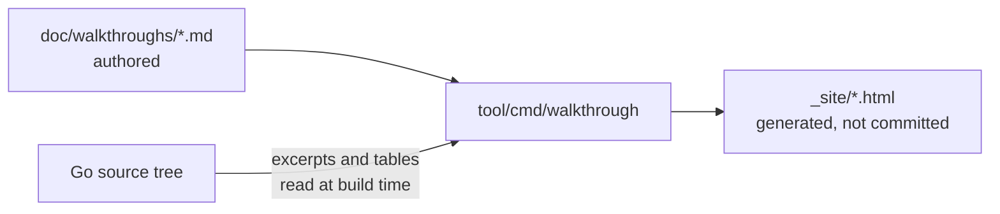

# Interactive walkthroughs

This directory holds step-by-step walkthroughs of Librarian for specific
questions, such as "what runs where during a release?" or "how would I add a
language to sidekick?".

Each walkthrough is a markdown file that GitHub renders as-is. The
`tool/cmd/walkthrough` command also compiles the same files into a small
interactive site: one step at a time, with code excerpts extracted from the
repository at build time, so the excerpts always match the commit the site was
built from.

## Source of truth

The code is the source of truth. The markdown files here hold only what the
code cannot say: why things are shaped the way they are, and in what order
to read them. Nothing else is checked in; the HTML site is built from the
markdown and the code, and is never committed.



Every statement on the site is kept true in one of three ways, strongest
first:

1. **Enforced by a test.** `TestDependencyRules` checks the package
   layering; `TestBuildDocs` checks that every excerpt anchor still
   resolves; `TestReproducible` checks that two builds of the same commit
   are byte-identical. Nobody maintains these; `go test ./...` does.
2. **Generated from the tree.** Code excerpts and the `generated` tables
   (package list, command list, language dispatch matrix, CI workflows) are
   computed by Go code from the checked-out commit. They cannot drift, and
   nobody edits them.
3. **Authored.** The prose, step order, badges and diagrams. This is the
   only part a human maintains, and it only needs to change when behavior
   changes.

Because of 1 and 2, the published site is a pure function of the commit it
was built from: same tree in, same bytes out. Keep it that way. Do not add
anything to the build that depends on time, network, or a language model;
agents are welcome to draft prose in a pull request that a person reviews,
never to regenerate content unattended in CI.

When a code change moves or removes an anchored line, `go test ./...` fails
and names the page and anchor. Update the anchor, or the prose if the
behavior changed, and rerun the check below.

## Building and previewing

```sh
go run ./tool/cmd/walkthrough -out _site
```

Open `_site/index.html` in a browser. The `_site` directory is ignored by git.
Use `-check` to resolve every excerpt without writing files; `TestBuildDocs` in
`tool/cmd/walkthrough` runs the same check, so a code change that removes a
line a walkthrough points at fails `go test ./...` until the anchor is updated.

The `Walkthroughs` workflow builds the site on every pull request that touches
these files (the result is attached as the `github-pages` artifact) and
deploys it to GitHub Pages on every push to `main`.

## Writing a walkthrough

A page needs YAML front matter and level-two headings; everything else is
regular markdown.

```markdown
---
title: What the page is about
summary: One or two sentences shown on the index.
audience: Who should read it
order: 3
nav: Short label
---

Introduction shown before the first step.

## First step
<!-- step runs="GitHub Actions in the language repository" code="librarian" -->

Step body. The optional HTML comment after a heading renders as badges that
say where the step runs and whose code does the work; GitHub hides it.
```

`nav` is optional and only shortens the page's label in the site header.
Files under `static/`, if present, are copied to the site unchanged and listed
on the index under "Related".

Four fenced blocks are rendered specially. On GitHub they show as code.

### Code excerpts

An `excerpt` block names a file and an anchor. The lines are read when the
site is built. For Go files the anchor is a `symbol`: a top-level function,
method (`Type.Method`), type, var or const. It survives edits to the
signature and body; only a rename or deletion breaks it, which is exactly
when the page needs a human anyway.

````markdown
```excerpt
file: internal/librarian/generate.go
symbol: generateLibraries
end: "+14"
highlight: "switch cfg.Language"
caption: Each language owns its generate/format ordering.
```
````

For other files the anchor is a `start` fragment that occurs on exactly one
line of the file.

````markdown
```excerpt
file: action.yaml
start: "- name: Install librarian"
end: "+6"
```
````

- `end` is optional: `+N` takes N lines, any other string takes lines up to
  and including the first later line containing it, and when omitted the
  symbol's whole declaration or the block closed by the brace that matches
  the start line is used (at most 60 lines, falling back to 10).
- With `start`, prefer anchors that are stable and unique, such as a
  distinctive string literal, over line numbers or common identifiers.

### Generated tables

A `generated` block is replaced by a table computed from the repository.
There is nothing to keep up to date.

````markdown
```generated
kind: dispatch
```
````

| Kind | Table | Options |
|---|---|---|
| `packages` | every Go package and the first sentence of its package comment | `prefix` to restrict to a path |
| `commands` | every `cli.Command` literal with its usage line | `dir` (default `internal/librarian`) |
| `dispatch` | each declaration that names a `config.Language*` constant, by language | `dir` (default `internal/librarian`) |
| `workflows` | each GitHub Actions workflow with its triggers and jobs | `dir` (default `.github/workflows`) |

Files from other repositories cannot be read at build time, so their excerpts
carry the code inline together with the repository and commit it was taken
from:

````markdown
```excerpt
file: librarian.yaml
repo: googleapis/google-cloud-rust
ref: 90c8b17e2b1a2e8f1b8d2a4b5c6d7e8f90123456
line: 1
code: |
  language: rust
  version: v0.47.0
```
````

### Flow diagrams

A `flow` block draws a swimlane diagram as inline SVG, which needs no
JavaScript or network access. Nodes are laid out left to right in the order
they are listed; `step` links a node to a step on the same page.

````markdown
```flow
title: Nightly regeneration
lanes:
  - id: ci
    label: GitHub Actions
    kind: ci
  - id: lib
    label: librarian
    kind: lib
nodes:
  - id: cron
    lane: ci
    label: scheduled workflow
  - id: gen
    lane: lib
    label: librarian generate --all
    step: 4
edges:
  - cron -> gen | go run
```
````

Lane and node `kind` values pick a color: `ci`, `lib` (librarian code),
`lang` (language repository code), `ext` (external tools), `user`.

### Mermaid

`mermaid` blocks render on GitHub natively. In the site they render through
mermaid.js loaded from a CDN when it is reachable and show the diagram source
otherwise, so prefer `flow` blocks for anything essential.

## See also

- [doc/styleguide/markdown-style-guide.md](../styleguide/markdown-style-guide.md):
  conventions for the markdown itself.
