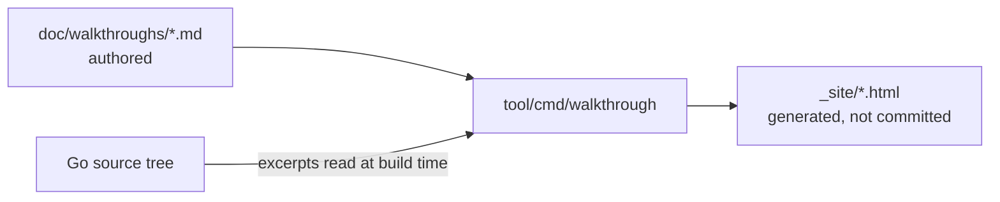

# Interactive walkthroughs

This directory holds step-by-step walkthroughs of Librarian for specific
questions, such as "what runs where during a release?" or "how would I add a
language to sidekick?". They complement the reference material in
[doc/architecture](../architecture/README.md).

Each walkthrough is a markdown file that GitHub renders as-is. The
`tool/cmd/walkthrough` command also compiles the same files into a small
interactive site: one step at a time, with code excerpts extracted from the
repository at build time, so the excerpts always match the commit the site was
built from.

## Source of truth

The markdown files in this directory are the source of truth. Nothing else is
checked in: the HTML site is built from them and is never committed.



You author and maintain:

- The markdown pages: prose, step order, badges, diagrams.
- The excerpt anchors: a file path and a string that occurs on exactly one
  line of that file. The code itself is not copied into the page; the tool
  reads it from the repository when the site is built.
- Excerpts from other repositories, which carry their code inline. These are
  the only excerpts that nothing checks.

Generated for you:

- The HTML site, by `tool/cmd/walkthrough` locally and by the `Walkthroughs`
  workflow on every pull request and on every push to `main`.
- The index page, from each page's front matter.

When a code change moves or removes an anchored line, `go test ./...` fails
and names the page and anchor. Update the anchor, or the prose if the
behavior changed, and rerun the check below.

## Building and previewing

```sh
go run ./tool/cmd/walkthrough -out _site
```

Open `_site/index.html` in a browser. The `_site` directory is ignored by git.
Use `-check` to resolve every excerpt without writing files; `TestBuildDocs` in
`tool/cmd/walkthrough` runs the same check, so a code change that removes a
line a walkthrough points at fails `go test ./...` until the anchor is updated.

The `Walkthroughs` workflow builds the site on every pull request that touches
these files (the result is attached as the `github-pages` artifact) and
deploys it to GitHub Pages on every push to `main`.

## Writing a walkthrough

A page needs YAML front matter and level-two headings; everything else is
regular markdown.

```markdown
---
title: What the page is about
summary: One or two sentences shown on the index.
audience: Who should read it
order: 3
nav: Short label
---

Introduction shown before the first step.

## First step
<!-- step runs="GitHub Actions in the language repository" code="librarian" -->

Step body. The optional HTML comment after a heading renders as badges that
say where the step runs and whose code does the work; GitHub hides it.
```

`nav` is optional and only shortens the page's label in the site header.
Files under `static/`, if present, are copied to the site unchanged and listed
on the index under "Related".

Three fenced blocks are rendered specially. On GitHub they show as code.

### Code excerpts

An `excerpt` block names a file and a fragment that occurs on exactly one line
of that file. The lines are read when the site is built.

````markdown
```excerpt
file: internal/librarian/generate.go
start: "func generateLibraries("
end: "+14"
highlight: "switch cfg.Language"
caption: Each language owns its generate/format ordering.
```
````

- `end` is optional: `+N` takes N lines, any other string takes lines up to
  and including the first later line containing it, and when omitted the
  block closed by the brace that matches the start line is used (at most 60
  lines, falling back to 10).
- Prefer anchors that are stable and unique, such as a function signature or
  a distinctive string literal, over line numbers or common identifiers.

Files from other repositories cannot be read at build time, so their excerpts
carry the code inline together with the repository and commit it was taken
from:

````markdown
```excerpt
file: librarian.yaml
repo: googleapis/google-cloud-rust
ref: 90c8b17e2b1a2e8f1b8d2a4b5c6d7e8f90123456
line: 1
code: |
  language: rust
  version: v0.47.0
```
````

### Flow diagrams

A `flow` block draws a swimlane diagram as inline SVG, which needs no
JavaScript or network access. Nodes are laid out left to right in the order
they are listed; `step` links a node to a step on the same page.

````markdown
```flow
title: Nightly regeneration
lanes:
  - id: ci
    label: GitHub Actions
    kind: ci
  - id: lib
    label: librarian
    kind: lib
nodes:
  - id: cron
    lane: ci
    label: scheduled workflow
  - id: gen
    lane: lib
    label: librarian generate --all
    step: 4
edges:
  - cron -> gen | go run
```
````

Lane and node `kind` values pick a color: `ci`, `lib` (librarian code),
`lang` (language repository code), `ext` (external tools), `user`.

### Mermaid

`mermaid` blocks render on GitHub natively. In the site they render through
mermaid.js loaded from a CDN when it is reachable and show the diagram source
otherwise, so prefer `flow` blocks for anything essential.

## See also

- [doc/architecture/README.md](../architecture/README.md): package-level
  reference documentation.
- [doc/styleguide/markdown-style-guide.md](../styleguide/markdown-style-guide.md):
  conventions for the markdown itself.
