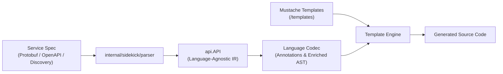

# Sidekick Guidelines for Agents

## Overview

`internal/sidekick` is the code generation engine in Librarian. It converts
service specifications (Protobuf descriptors, OpenAPI, and Discovery documents)
into idiomatic client libraries across supported languages (such as Swift, Rust,
and Dart).

The end-to-end generation pipeline follows these distinct stages:

1. **Parsing:** `internal/sidekick/parser` parses the input specification into a
   language-agnostic intermediate representation: `api.API`.
2. **Annotation / Codec:** The target language package
   (`internal/sidekick/<lang>`) decorates the `api.API` model with
   language-specific metadata and types (stored in `node.Codec`).
3. **Template Rendering:** The annotated model is passed to Mustache templates
   (`internal/sidekick/<lang>/templates`) to render target source code.
4. **Formatting:** Generated source files are formatted using target language
   toolchains.



## Architectural Blueprint: Lessons from Swift

When designing or modifying language generators, **treat `sidekick/swift` as the
architectural reference implementation.**

Swift has the benefit of hindsight. Earlier implementations like `sidekick/rust`
were created while learning how best to structure code generation in Librarian,
resulting in several large, monolithic files (such as 50KB+ `codec.go` and
`codec_test.go`). In Swift, those lessons were applied to create a modular,
decoupled architecture:

- **Decomposed helper packages:** Separate concerns into small, focused files
  (e.g., `names.go`, `doc_link.go`, `format_path.go`, `field_type_name.go`,
  `storage.go`, `dependency.go`).
- **1:1 Helper test files:** Every helper file has a dedicated test file
  (`names_test.go`, `format_path_test.go`, etc.) with comprehensive unit tests.
- **Slim orchestrator:** `codec.go` remains focused on orchestrating the
  generation steps rather than accumulating string formatting or template
  logic.
- **Granular generation tests:** Test generation by feature in separate test
  files (e.g., `generate_enum_swift_test.go`, `generate_message_swift_test.go`,
  `generate_method_signatures_test.go`, `generate_pagination_swift_test.go`)
  rather than a single monolithic test file.

## Annotation Architecture

Language codecs decorate the `api.API` abstract syntax tree by attaching
language-specific annotation structs to the `Codec any` field of each model node
(`Message.Codec`, `Enum.Codec`, `Field.Codec`, `Service.Codec`, etc.).

### One File Per Annotation Type

When adding or modifying annotations:

1. **Dedicated Source File:** Every AST node type that requires
   language-specific decoration (`Service`, `Method`, `Message`, `Field`,
   `Enum`, `EnumValue`, `OneOf`, etc.) **MUST** have its own dedicated source
   file (e.g., `annotate_service.go`, `annotate_method.go`,
   `annotate_message.go`, `annotate_field.go`, `annotate_enum.go`,
   `annotate_enum_value.go`, `annotate_oneof.go`).
   - Even when an annotation struct is initially small or trivial (containing
     only 1–2 fields), place it in its own file from day one. Do not attach
     unrelated concerns to `serviceAnnotations` or merge node annotations
     together. This establishes a clean structure that keeps files small and
     focused as the codec grows.
2. **Dedicated Test File:** Pair every annotation file with a matching
   `_test.go` file (e.g., `annotate_enum_test.go`, `annotate_field_test.go`,
   `annotate_service_test.go`).
3. **Driver:** `annotate_model.go` coordinates the annotation passes across all
   messages, enums, and services. Annotate messages and enums before services if
   services depend on message annotations. Never bury model traversal or file
   manifest calculation inside individual node annotation files.

### Annotation Tests

Annotation tests should verify that `codec.annotateModel()` produces the
expected annotation struct on the corresponding model element:

- Use `cmp.Diff(want, got, cmpopts.IgnoreFields(...))` to assert annotations.
- Separate error scenarios into dedicated `TestAnnotateXxx_Error(t *testing.T)`
  functions.
- Separate trait or feature-gating tests into
  `TestAnnotateXxx_Gating(t *testing.T)`.

## Template Architecture & Boilerplate

Mustache templates (`internal/sidekick/<lang>/templates/`) define the emitted
source code structure.

### Template and Output Boilerplate

- **Template Copyright Header:** Every `.mustache` file itself must begin with
  an Apache 2.0 license comment enclosed in Mustache comment delimiters
  (`{{! ... }}`). Always use the current year for newly created files. See
  [`swift/templates/common/service.swift.mustache`](swift/templates/common/service.swift.mustache)
  for an example of this template comment header.
- **Output File Boilerplate:** Templates that render standalone source files
  (not partials) must emit the target file's license and copyright boilerplate.
- **Reusable Partials:** Output boilerplate must be rendered using a reusable
  Mustache partial (e.g., `{{> /templates/partials/prologue}}`), referencing
  `Codec.Model.CopyrightYear` and `Codec.Model.BoilerPlate` (or
  `Codec.CopyrightYear` and `Codec.BoilerPlate` when rendering root models),
  rather than duplicating license text across dozens of templates. See
  [`codec_sample/templates/readme/README.md.mustache`](codec_sample/templates/readme/README.md.mustache)
  for an example.
- **Decomposition via Partials:** Decompose complex files into logical partials
  (e.g., method signatures, routing matchers, client protocols, documentation
  blocks).

## Anti-Patterns & Architectural Guardrails

To preserve generator quality and maintainability across all languages, every
sidekick generator must adhere strictly to these architectural invariants:

### 1. Zero Target-Language Generation in Go Source

- **Templates Own Syntax:** Never use `strings.Builder`, `fmt.Sprintf`, or
  string concatenation in Go code to assemble target-language class definitions,
  constructors, functions, control flow, lambdas, or routing matchers.
- **Templates Own Formatting:** Never construct multi-line doc comments (e.g.
  Doxygen `///` blocks) or hand-craft continuation indentations in Go.
- Annotation methods should expose typed data slices or simple strings (e.g.,
  returning `[]FieldAnnotation` or a clean string), allowing Mustache templates
  and partials to handle iteration, syntax, and indentation.

### 2. Parser & AST Fidelity (Extend Parsers, Do Not Re-Parse)

- **No Regex Re-Parsers:** Never write regex parsers, tokenizers, or filesystem
  walkers to re-parse `.proto`, OpenAPI, or Discovery documents from within a
  language generator (e.g. attempting to rediscover symbol line numbers or
  extract comments).
- **Extend the Shared Parser:** If the intermediate representation (`api.API`)
  lacks information needed by your language (such as `SourceCodeInfo` locations,
  unprocessed annotations, or routing parameter ordering), **extend
  `internal/sidekick/parser` and `internal/sidekick/api`**.
- All generators benefit when the shared parser is enhanced to provide richer
  AST metadata.

### 3. Strict Isolation from Test Fixtures

- **No Fixture Logic in Production:** Never branch on test fixture names (e.g.,
  `if s.Name == "GoldenKitchenSink"`) or hardcode fixture paths in production
  generator code. If the generator needs custom logic for a fixture, add
  configuration to `librarian.yaml` to enable the logic.
- **No Hardcoded Symbol Tables:** Never compile hardcoded symbol-to-line or
  fixture-specific translation tables into shipping binaries. If line numbers or
  cross-references are needed, obtain them dynamically from the parsed AST.

### 4. Configuration Safety & Immutability

- **Read-Only Input:** Treat `config.Library` as read-only. Never mutate
  configuration fields in place (e.g., writing derived absolute paths to
  `ProductPath` or `SourceRoot`).
- **Complete Merging & Defaults:** Every language must implement full field
  merging in `merge<Lang>` (in `internal/librarian/library.go`) and defaults in
  `fill<Lang>`. Never silently drop configuration fields during preview
  resolution.

### 5. Output Directory Hermeticity

- **Strict `outdir` Containment:** All emitted files must be written strictly
  under the designated output directory (`outdir`).
- **No Path Escapes:** Generated file relative paths must never contain `..`
  segments that escape `outdir`. Escaping `outdir` breaks `librarian clean` and
  leaves orphan files on disk.

### 6. Formatting & Parity Standards

- **Golden Parity Exception:** Parity tests against legacy upstream golden files
  may use `DisableFormat: true` when matching historical, unformatted golden
  fixtures.
- **Production Formatting Required:** In production generation, active toolchain
  formatting (e.g., `clang-format`, `swift-format`, `rustfmt`) is mandatory.
  The formatting step must fail loudly if the formatter tool is missing or
  encounters syntax errors.

### 7. Granular Unit Test Coverage

- **Do Not Rely Exclusively on Goldens:** End-to-end golden tests catch diffs
  but fail to isolate causes. Every annotation method, feature gate, and
  template helper must have dedicated unit tests.
- **Test Headline Features Directly:** Critical features (such as LRO, REST
  transports, paginated RPCs, or `OperationService`) must have explicit unit
  tests in `api`, `parser`, and the language package.
- **Avoid Monolithic Test Files:** Split test files by feature or domain rather
  than creating monolithic test suites. If the test file is over 1000 lines, it
  is time to split the file.

### 8. Cross-Language Blast Radius

- **Protect Shared Types:** When updating shared packages (`api`, `parser`,
  `sources`, `librarian`), verify that changes do not break or alter semantics
  for other languages.
- **No Incomplete Synthesized Nodes:** Never synthesize partial or invalid model
  objects (such as creating an `OperationInfo` with an empty `MetadataTypeID`)
  that might cause nil-pointer dereferences or lookup failures in other language
  generators.

## Test Data Modeling with `api.NewTest*()`

### Always Use Test Helpers

When writing tests in `internal/sidekick`, **never construct raw `api.*`
structs manually**. Always use the fluent `api.NewTest*()` helpers provided in
`internal/sidekick/api/test.go`.

```go
// GOOD: Uses fluent api.NewTest*() builders
msg := api.NewTestMessage("Operation").
    WithPackage("google.longrunning").
    WithFields(
        api.NewTestField("name").WithType(api.TypezString),
        api.NewTestField("done").WithType(api.TypezBool),
    )
model := api.NewTestAPI([]*api.Message{msg}, nil, nil)

// BAD: Manual struct instantiation with raw fields
msg := &api.Message{
    Name:    "Operation",
    Package: "google.longrunning",
    ID:      ".google.longrunning.Operation",
    Fields: []*api.Field{
        {Name: "name", Typez: api.TypezString, ID: ".google.longrunning.Operation.name"},
    },
}
```

### Specifying Field Types: `WithType()` and `WithMessageType()`

When configuring field types on `*api.Field`, prefer the builder methods instead
of setting `Typez`, `TypezID`, or `MessageType` manually:

- **Primitive & Scalar Types:** Use `.WithType(api.Typez...)` (e.g.,
  `.WithType(api.TypezString)`, `.WithType(api.TypezInt32)`,
  `.WithType(api.TypezBytes)`).
- **Referenced Message Types:** Define the referenced message first and use
  `.WithMessageType(referencedMsg)`. This automatically sets `Typez =
  api.TypezMessage`, `TypezID = referencedMsg.ID`, and links `MessageType =
  referencedMsg`, avoiding hardcoded type ID strings and redundant assignments:

```go
// GOOD: Define referenced message first and use WithMessageType()
secretType := api.NewTestMessage("Secret").WithPackage("google.cloud.secretmanager.v1")
itemField := api.NewTestField("secrets").
    WithMessageType(secretType).
    WithRepeated()

// BAD: Manually specifying Typez and hardcoding TypezID strings
badItemField := api.NewTestField("secrets").
    WithType(api.TypezMessage).
    WithRepeated()
badItemField.TypezID = ".google.cloud.secretmanager.v1.Secret"
badItemField.MessageType = secretType
```

### Standard Available Helpers

The following builders are defined in `internal/sidekick/api/test.go`:

| Helper                                      | Description & Key Fluent Methods                                                                                                                                |
| :------------------------------------------ | :-------------------------------------------------------------------------------------------------------------------------------------------------------------- |
| `api.NewTestAPI(messages, enums, services)` | Initializes and indexes the root `*api.API` model                                                                                                               |
| `api.NewTestMessage(name)`                  | `.WithPackage()`, `.WithFields()`, `.WithOneOfs()`, `.WithPagination()`, `.WithResource()`                                                                      |
| `api.NewTestService(name)`                  | `.WithPackage()`, `.WithMethods()`                                                                                                                              |
| `api.NewTestMethod(name)`                   | `.WithVerb()`, `.WithInput()`, `.WithOutput()`, `.WithPathTemplate()`, `.WithSignatures()`, `.WithOperationInfo()`, `.WithPagination()`, `.WithBidiStreaming()` |
| `api.NewTestField(name)`                    | `.WithType()`, `.WithRepeated()`, `.WithOptional()`, `.WithMap()`, `.WithBehavior()`, `.WithMessageType()`, `.WithResourceReference()`                          |
| `api.NewTestOneOf(name)`                    | `.WithFields()`                                                                                                                                                 |
| `api.NewTestResource(typez)`                | `.WithPatterns()`, `.WithSingular()`, `.WithPlural()`                                                                                                           |

### Extending Test Helpers

If a test requires model capabilities or configurations not yet supported by
the existing `api.NewTest*()` functions:

- **Add them to `internal/sidekick/api/test.go`**: Do not write one-off model
  constructors inside individual language packages. Extending `api/test.go`
  keeps model construction uniform across all language codecs.
- **Follow the Fluent Pattern**: Methods on `*api.Message`, `*api.Field`,
  `*api.Method`, etc., should return the receiver pointer (`*T`) to allow
  method chaining.
- **Never Call Test Builders on Production Paths**: Builders like
  `api.NewTestAPI` belong strictly in tests (`*_test.go`) or test helper
  packages. Calling test helpers on production execution paths masks errors and
  leads to silent misconfiguration.
- **Language Fixtures Stay Local**: Language-specific test fixtures (such as
  `newTestCodec(t, model, ...)` or template loaders) belong in the respective
  language test package, not in `api/test.go`.

## Code & Testing Conventions

Follow Librarian's overall Go guidelines ([`AGENTS.md`](../../AGENTS.md) and
[`doc/howwewritego.md`](../../doc/howwewritego.md)):

- **Table-Driven Tests:** Write `for _, test := range []struct { ... }{ ... }`
  directly without naming the slice. Always name the iteration variable `test`.
- **Subtests:** Run subtests with
  `t.Run(test.name, func(t *testing.T) { ... })`.
- **Assertions:** Use `cmp.Diff(test.want, got)` for comparisons.
- **Multi-line Strings:** Use raw string literals (backticks `` ` ``) for
  expected template or code outputs.
- **Error Tests:** Keep error cases in separate `TestXxx_Error` functions.

## Workflow & Verification

After editing code in `internal/sidekick`, run these verification steps:

```bash
# Format code
gofmt -s -w .

# Organize imports
go tool goimports -w .

# Run linter on sidekick packages
go tool golangci-lint run ./internal/sidekick/...

# Run unit tests
go test -short ./internal/sidekick/...

# Run race detector before committing
go test -race ./internal/sidekick/...
```
