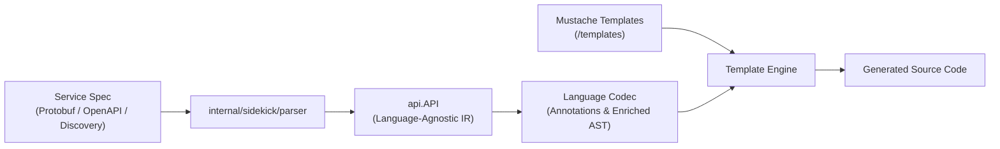

# Sidekick Guidelines for Gemini

## Overview

`internal/sidekick` is the code generation engine in Librarian. It converts
service specifications (Protobuf descriptors, OpenAPI, and Discovery documents)
into idiomatic client libraries across supported languages (such as Swift, Rust,
and Dart).

The end-to-end generation pipeline follows these distinct stages:

1. **Parsing:** `internal/sidekick/parser` parses the input specification into a
   language-agnostic intermediate representation: `api.API`.
2. **Annotation / Codec:** The target language package
   (`internal/sidekick/<lang>`) decorates the `api.API` model with
   language-specific metadata and types (stored in `node.Codec`).
3. **Template Rendering:** The annotated model is passed to Mustache templates
   (`internal/sidekick/<lang>/templates`) to render target source code.
4. **Formatting:** Generated source files are formatted using target language
   toolchains.



## Architectural Blueprint: Lessons from Swift

When designing or modifying language generators, **treat `sidekick/swift` as the
architectural reference implementation.**

Swift has the benefit of hindsight. Earlier implementations like `sidekick/rust`
were created while learning how best to structure code generation in Librarian,
resulting in several large, monolithic files (such as 50KB+ `codec.go` and
`codec_test.go`). In Swift, those lessons were applied to create a modular,
decoupled architecture:

- **Decomposed helper packages:** Separate concerns into small, focused files
  (e.g., `names.go`, `doc_link.go`, `format_path.go`, `field_type_name.go`,
  `storage.go`, `dependency.go`).
- **1:1 Helper test files:** Every helper file has a dedicated test file
  (`names_test.go`, `format_path_test.go`, etc.) with comprehensive unit tests.
- **Slim orchestrator:** `codec.go` remains focused on orchestrating the
  generation steps rather than accumulating string formatting or template
  logic.
- **Granular generation tests:** Test generation by feature in separate test
  files (e.g., `generate_enum_swift_test.go`, `generate_message_swift_test.go`,
  `generate_method_signatures_test.go`, `generate_pagination_swift_test.go`)
  rather than a single monolithic test file.

## Annotation Architecture

Language codecs decorate the `api.API` abstract syntax tree by attaching
language-specific annotation structs to the `Codec any` field of each model node
(`Message.Codec`, `Enum.Codec`, `Field.Codec`, `Service.Codec`, etc.).

### One File Per Annotation Type

When adding or modifying annotations:

1. **Dedicated Source File:** Create a separate `.go` file for each annotation
   type (e.g., `annotate_enum.go`, `annotate_enum_value.go`,
   `annotate_field.go`, `annotate_message.go`, `annotate_method.go`,
   `annotate_model.go`, `annotate_oneof.go`, `annotate_service.go`).
2. **Dedicated Test File:** Pair every annotation file with a matching
   `_test.go` file (e.g., `annotate_enum_test.go`, `annotate_field_test.go`).
3. **Driver:** `annotate_model.go` coordinates the annotation passes across all
   messages, enums, and services. Annotate messages and enums before services if
   services depend on message annotations.

### Annotation Tests

Annotation tests should verify that `codec.annotateModel()` produces the
expected annotation struct on the corresponding model element:

- Use `cmp.Diff(want, got, cmpopts.IgnoreFields(...))` to assert annotations.
- Separate error scenarios into dedicated `TestAnnotateXxx_Error(t *testing.T)`
  functions.
- Separate trait or feature-gating tests into
  `TestAnnotateXxx_Gating(t *testing.T)`.

## Test Data Modeling with `api.NewTest*()`

### Always Use Test Helpers

When writing tests in `internal/sidekick`, **never construct raw `api.*`
structs manually**. Always use the fluent `api.NewTest*()` helpers provided in
`internal/sidekick/api/test.go`.

```go
// GOOD: Uses fluent api.NewTest*() builders
msg := api.NewTestMessage("Operation").
    WithPackage("google.longrunning").
    WithFields(
        api.NewTestField("name").WithType(api.TypezString),
        api.NewTestField("done").WithType(api.TypezBool),
    )
model := api.NewTestAPI([]*api.Message{msg}, nil, nil)

// BAD: Manual struct instantiation with raw fields
msg := &api.Message{
    Name:    "Operation",
    Package: "google.longrunning",
    ID:      ".google.longrunning.Operation",
    Fields: []*api.Field{
        {Name: "name", Typez: api.TypezString, ID: ".google.longrunning.Operation.name"},
    },
}
```

### Specifying Field Types: `WithType()` and `WithMessageType()`

When configuring field types on `*api.Field`, prefer the builder methods instead
of setting `Typez`, `TypezID`, or `MessageType` manually:

- **Primitive & Scalar Types:** Use `.WithType(api.Typez...)` (e.g.,
  `.WithType(api.TypezString)`, `.WithType(api.TypezInt32)`,
  `.WithType(api.TypezBytes)`).
- **Referenced Message Types:** Define the referenced message first and use
  `.WithMessageType(referencedMsg)`. This automatically sets `Typez =
  api.TypezMessage`, `TypezID = referencedMsg.ID`, and links `MessageType =
  referencedMsg`, avoiding hardcoded type ID strings and redundant assignments:

```go
// GOOD: Define referenced message first and use WithMessageType()
secretType := api.NewTestMessage("Secret").WithPackage("google.cloud.secretmanager.v1")
itemField := api.NewTestField("secrets").
    WithMessageType(secretType).
    WithRepeated()

// BAD: Manually specifying Typez and hardcoding TypezID strings
badItemField := api.NewTestField("secrets").
    WithType(api.TypezMessage).
    WithRepeated()
badItemField.TypezID = ".google.cloud.secretmanager.v1.Secret"
badItemField.MessageType = secretType
```

### Standard Available Helpers

The following builders are defined in `internal/sidekick/api/test.go`:

| Helper | Description & Key Fluent Methods |
| :--- | :--- |
| `api.NewTestAPI(messages, enums, services)` | Initializes and indexes the root `*api.API` model |
| `api.NewTestMessage(name)` | `.WithPackage()`, `.WithFields()`, `.WithOneOfs()`, `.WithPagination()`, `.WithResource()` |
| `api.NewTestService(name)` | `.WithPackage()`, `.WithMethods()` |
| `api.NewTestMethod(name)` | `.WithVerb()`, `.WithInput()`, `.WithOutput()`, `.WithPathTemplate()`, `.WithSignatures()`, `.WithOperationInfo()`, `.WithPagination()`, `.WithBidiStreaming()` |
| `api.NewTestField(name)` | `.WithType()`, `.WithRepeated()`, `.WithOptional()`, `.WithMap()`, `.WithBehavior()`, `.WithMessageType()`, `.WithResourceReference()` |
| `api.NewTestOneOf(name)` | `.WithFields()` |
| `api.NewTestResource(typez)` | `.WithPatterns()`, `.WithSingular()`, `.WithPlural()` |

### Extending Test Helpers

If a test requires model capabilities or configurations not yet supported by
the existing `api.NewTest*()` functions:

- **Add them to `internal/sidekick/api/test.go`**: Do not write one-off model
  constructors inside individual language packages. Extending `api/test.go`
  keeps model construction uniform across all language codecs.
- **Follow the Fluent Pattern**: Methods on `*api.Message`, `*api.Field`,
  `*api.Method`, etc., should return the receiver pointer (`*T`) to allow
  method chaining.
- **Language Fixtures Stay Local**: Language-specific test fixtures (such as
  `newTestCodec(t, model, ...)` or template loaders) belong in the respective
  language test package, not in `api/test.go`.

## Code & Testing Conventions

Follow Librarian's overall Go guidelines ([`AGENTS.md`](../../AGENTS.md) and
[`doc/howwewritego.md`](../../doc/howwewritego.md)):

- **Table-Driven Tests:** Write `for _, test := range []struct { ... }{ ... }`
  directly without naming the slice. Always name the iteration variable `test`.
- **Subtests:** Run subtests with
  `t.Run(test.name, func(t *testing.T) { ... })`.
- **Assertions:** Use `cmp.Diff(test.want, got)` for comparisons.
- **Multi-line Strings:** Use raw string literals (backticks `` ` ``) for
  expected template or code outputs.
- **Error Tests:** Keep error cases in separate `TestXxx_Error` functions.

## Workflow & Verification

After editing code in `internal/sidekick`, run these verification steps:

```bash
# Format code
gofmt -s -w .

# Organize imports
go tool goimports -w .

# Run linter on sidekick packages
go tool golangci-lint run ./internal/sidekick/...

# Run unit tests
go test -short ./internal/sidekick/...

# Run race detector before committing
go test -race ./internal/sidekick/...
```
