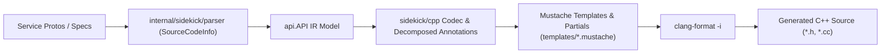

# Migration Plan: google-cloud-cpp Generator to Librarian & Sidekick

## 1. Executive Summary & Objective

This document defines the implementation roadmap for replacing `google-cloud-cpp/generator` with a native Go-based generator in `librarian` and `sidekick` (`internal/sidekick/cpp`). The goal is 100% byte-for-byte parity with existing generated C++ code, adhering to the architectural principles of `internal/sidekick/swift`.

---

## 2. Core Architectural Principles & Guidelines

| Guideline | Standard | Implementation Strategy |
| :--- | :--- | :--- |
| **Commit Directory Scoping** | Single-directory commits | Every commit must be strictly scoped to a single directory (e.g., `internal/sidekick/cpp`, `internal/librarian/cpp`, `internal/config`). If a change must cross directory boundaries (such as initial bootstrapping or shared parser enhancements), the agent must pause and ask for user confirmation. |
| **Equivalence Standard** | Exact byte-for-byte parity | Retain exact banner (`// Generated by the Codegen C++ plugin.`) and copyright header. Legacy golden files in `generator/integration_tests/golden/` have `DisableFormat: true` from the upstream generator (.clang-format); legacy parity tests match unformatted goldens with `DisableFormat: true`. Active toolchain formatting is required and verified in production oracles (Phases 6–9) where `clang-format` is standard. |
| **Parser & AST Fidelity** | Extend parser, zero regex re-parsing | Never re-parse `.proto` files with regex or disk scans (forbidding `proto_index.go`). Obtain symbol source locations (`File`, `Line`) and comments directly from `internal/sidekick/parser` using `SourceCodeInfo` from `FileDescriptorSet`. Never use hardcoded symbol location tables (forbidding `defaultProtoLocations`). |
| **Template-First Emission** | Zero in-Go C++ generation | Never generate C++ classes, constructors, methods, control flow, lambdas, or routing matchers via `strings.Builder` or `fmt.Sprintf`. Templates and reusable Mustache partials own all syntax, formatting, and indentation. |
| **Mustache Partials** | Modular templates & shared prologue | Use Mustache partials (`{{> prologue}}`) for shared license/banner headers across all templates. Use partials for routing matchers, constructors, and method signatures. |
| **Decomposed Annotations** | One file per node type | Separate annotation structs into dedicated files (`annotate_model.go`, `annotate_service.go`, `annotate_method.go`, `annotate_field.go`, `annotate_enum.go`), paired 1:1 with `_test.go` files from day one. |
| **Configuration Completeness** | Immutable, complete merge & fill | Treat `config.Library` as read-only (no mutating `ProductPath` or `SourceRoot`). Implement complete 22-field merging in `mergeCpp` and complete defaults in `fillCpp`. |
| **Output Hermeticity** | Strict `outdir` containment | All generated files (including forwarding headers) must stay strictly under `outdir`. Relative paths containing `..` that escape `outdir` are forbidden so `librarian clean` works correctly. |
| **Hermetic Testing & Oracles** | Dynamic SHA, non-vacuous tests | Use dynamic googleapis SHA resolution; zero hardcoded `$HOME` paths. Unit tests must use `extractBlock` to test annotation accessors granularly. Assert file contents, not just file existence or sizes. Dedicated unit tests required for `OperationService`. |
| **No Fixture Branching** | Clean production code | Never branch on test fixture names (such as `GoldenKitchenSink`) in production code. Production logic must be completely decoupled from fixture data. |
| **No Test Helpers in Production** | Strict separation | Never call test builders like `api.NewTestAPI` on production paths. Misconfigured libraries must fail loudly with errors. |
| **Review each commit** | Coding | After each commit, spawn a subagent to review the code using the `review-pr` skill from `.agents/skills/review-pr/SKILL.md` (ignoring commit message guidelines). Address findings before proceeding. |
| **Align after each step** | Architecture | After each phase, spawn a subagent to review the changes against the architectural guidelines in the `GEMINI.md` files and in this plan. If the subagent reports any deviations, ask the user how to proceed. |
| **Worktree Topology** | Isolated Worktrees | All development occurs in dedicated worktrees: `librarian/cpp-migration` (branch `cpp-migration`) for generator development, and `google-cloud-cpp/cpp-migration` (branch `cpp-migration`) for golden references and production parity checks. |

---

## 3. Phased Implementation Roadmap

### Phase 1: Scaffold, Complete Configuration & Minimal Codec [COMPLETED]
- **Goal**: Establish the C++ target in Librarian with complete configuration handling and emit a minimal `CMakeLists.txt`.
- **Status**: Completed and verified.
- **Delivered Commits**:
  - `35c7ce97` `feat(internal/config)`: Added `LanguageCpp = "cpp"`, complete 22-field `CppLibrary`, `CppDefault`, and `ClangFormat` tool schema.
  - `6c804b3b` `feat(internal/librarian)`: Implemented complete 22-field merge in `mergeCpp`, defaults in `fillCpp`, and unit tests in `library_test.go`.
  - `889007c8` `feat(internal/sidekick/cpp)`: Scaffolded C++ sidekick codec, full 8-node decomposed annotators (`model`, `service`, `method`, `message`, `field`, `oneof`, `enum`, `enum_value`), `CMakeLists.txt` template, and tests.
  - `d0f10f82` `feat(internal/librarian/cpp)`: Implemented generation orchestration, `format.go` (wrapping `clang-format`), and dispatch in `internal/librarian/generate.go`.
  - `b0eb3ba1` `fix(internal/sidekick/cpp)`: Handled leading slashes in output containment and updated prologue partial to use dynamic `Codec.BoilerPlate`.
  - `d9c557c7` `fix(internal/librarian/cpp)`: Wired `OverrideServiceConfigYAMLName` into `libraryToModelConfig`.
  - `18ba88f8` `docs(internal/sidekick/cpp)`: Moved `cpp-migration-plan.md` into `internal/sidekick/cpp/`.
  - `0f13de11` `docs(config)`: Updated `doc/config-schema.md` with C++ configuration schemas.
- **Verification**: `gofmt -s`, `goimports`, `golangci-lint` (0 issues), and unit tests pass across all touched packages.

### Phase 2: Parser `SourceCodeInfo` Integration & Hermetic Fixtures
- **Goal**: Augment the shared parser with `SourceCodeInfo` locations and import test fixtures without regex parsing or fixture branching.
- **Staging & Commits**:
  - **Stage 2A: Shared Parser Enhancements (`internal/sidekick/parser`, `internal/sidekick/api`)**:
    1. Augment `internal/sidekick/parser` to extract symbol line locations (`File`, `Line`) from protobuf `SourceCodeInfo` and attach them to `api.API` elements.
    2. Ensure `internal/sidekick/parser` preserves routing parameter order.
    3. Parse `OperationService` safely without synthesizing incomplete `OperationInfo` with empty `MetadataTypeID`.
    4. Run cross-language regression checks (`go test ./internal/sidekick/parser/...`, `go test ./internal/sidekick/swift/...`, `go test ./internal/sidekick/rust/...`) to ensure zero blast radius.
    5. Run commit review subagent with `review-pr`.
  - **Stage 2B: Hermetic Fixtures & Test Harness (`internal/sidekick/cpp`)**:
    1. Copy test protos (`test.proto`, `test2.proto`, `test_request_id.proto`, `test_deprecated.proto`, `backup.proto`, `common.proto`) from `google-cloud-cpp/generator/integration_tests/golden/` into `internal/sidekick/cpp/testdata/protos/`.
    2. Copy golden reference files (188 files) from `google-cloud-cpp/generator/integration_tests/golden/` into `internal/sidekick/cpp/testdata/golden/`.
    3. Create `internal/sidekick/cpp/testdata/golden_librarian.yaml` mapping test services to Librarian configuration.
    4. Implement hermetic test harness parsing test protos into `api.API`.
    5. Strictly forbid `proto_index.go`, regex parsing, `defaultProtoLocations`, and fixture branching (`GoldenKitchenSink`).
    6. Run commit review subagent with `review-pr`.
  - **Phase 2 Alignment Review**:
    - Spawn architectural alignment subagent to review changes against `internal/sidekick/GEMINI.md` and this plan.
- **Verification**: `go test ./internal/sidekick/parser/...`, `go test ./internal/sidekick/cpp/...`, and cross-language tests.

### Phase 3: Layered Emission — gRPC End-to-End & Decomposed Architecture
- **Goal**: Complete gRPC generation using Mustache templates and partials, achieving byte-for-byte parity on pure gRPC services (`GoldenRequestId`, pure gRPC subset of `GoldenKitchenSink`, `GoldenDeprecated`).
- **Layers**:
  - **Layer 3.1: Empty Shells & Output Paths**: Emit file shells for all gRPC and common files. Ensure all paths remain strictly inside `outdir`.
  - **Layer 3.2: #includes & #ifdef Guards**: Emit copyright headers and banners via `{{> prologue}}`, `#ifndef ... #define ... #endif` guards, and `#include` directives. Assert via `extractBlock()`.
  - **Layer 3.3: Namespaces**: Emit namespace opening/closing blocks (`google::cloud::<service>_v1`, etc.) via templates. Assert via `extractBlock()`.
  - **Layer 3.4: Class Skeletons**: Emit class definitions, inheritance hierarchies, and access specifiers via templates. Assert via `extractBlock()`.
  - **Layer 3.5: Function Declarations (.h)**: Emit complete method signatures for unary, paging, LRO, and streaming RPCs, including overloads and Doxygen comments via templates. Assert via `extractBlock()`.
  - **Layer 3.6: Function Definitions (.cc)**: Emit method implementations, member initializers, stub constructors, and routing matchers via Mustache templates and partials. Zero in-Go C++ generation. Assert via `extractBlock()`.
  - **Layer 3.7: Formatting & Parity**: Assert zero diff against golden files for pure gRPC services (using `DisableFormat: true` to match upstream legacy goldens).
- **Verification**: Dedicated unit tests with `extractBlock` for all annotation accessors; `go test ./internal/sidekick/cpp/...`.

### Phase 4: Layered Emission — REST Transports & Mixed Services
- **Goal**: Implement REST transport generation using partials and achieve 100% byte-for-byte parity across all 188 golden files.
- **Tasks**:
  1. Add HTTP path parsing, query parameter extraction, and URL template substitution.
  2. Implement REST templates and partials: `rest_stub.h`, `rest_stub.cc`, `rest_connection_impl.h`, `rest_connection_impl.cc`, `rest_logging_decorator`, `rest_metadata_decorator`, `rest_stub_factory`.
  3. Align `.h` and `.cc` LRO feature gates (`HasLRO` vs `HasGrpcLRO`).
  4. Implement dedicated unit tests for `OperationService` in `cpp`, `parser`, and `api`.
  5. Add dedicated unit tests for all REST query param and path formatting accessors.
  6. Assert 100% byte-for-byte zero diff across all 188 files in golden fixtures (with `DisableFormat: true` matching upstream goldens).
- **Verification**: `go test ./internal/sidekick/cpp/...`.

### Phase 5: Automated Configuration Migration Tool [COMPLETED]
- **Goal**: Provide automated translation from `generator_config.textproto` to native `librarian.yaml` with strict validation.
- **Status**: Completed and verified.
- **Delivered Commits**:
  - `2c52bbe8` `feat(internal/config)`: Add `ServiceNameMapping` and `ServiceNameToComment` to `CppLibrary`.
  - `3426ec28` `feat(internal/librarian)`: Merge `ServiceNameMapping` and `ServiceNameToComment` in `CppLibrary`.
  - `fa791223` `feat(internal/librarian/cpp)`: Implement textproto to `librarian.yaml` configuration converter.
  - `735a3c19` `feat(tool/cmd/migrate)`: Add C++ `generator_config.textproto` migration command.
  - `100aefb3` `docs(doc)`: Update `config-schema.md` with `CppLibrary` fields.
- **Verification**: Converter unit tests pass; `tool/cmd/migrate` tests pass with `-race`; `golangci-lint` passes with 0 issues; all 10 architectural invariants verified.

### Phase 6: Production Oracle 2 — Secret Manager Pilot [COMPLETED]
- **Goal**: Generate `google/cloud/secretmanager/v1` from production `googleapis` protos with 100% parity and active formatting.
- **Status**: Completed and verified.
- **Delivered Commits**:
  - `db830b00` `feat(internal/sidekick/parser)`: Add definition locations for common mixin request and response types.
  - `b48d9910` `fix(internal/sidekick/cpp)`: Resolve stub mixin constructor and class comment reference links.
  - `9ac82f93` `test(internal/librarian/cpp)`: Add Secret Manager v1 integration pilot test.
- **Verification**: `go test -tags integration -v ./internal/librarian/cpp -run TestSecretManagerPilot` passes with 100% byte-for-byte parity across all 33 generated files; unit tests and linters pass cleanly.

### Phase 7: Production Oracle 3 — Workloads (`assuredworkloads`) [COMPLETED]
- **Goal**: Support LRO operations and specialized method signatures, achieving parity on Workloads with active formatting.
- **Status**: Completed and verified.
- **Delivered Commits**:
  - `d4d1d6e7` `fix(internal/sidekick/cpp)`: Retain HTTP-routed Operations mixin methods and scope async retry loop include.
  - `407eceec` `test(internal/librarian/cpp)`: Add Assured Workloads v1 integration oracle test.
- **Verification**: `go test -tags integration -v ./internal/librarian/cpp -run TestAssuredWorkloads` passes with 100% byte-for-byte parity across all 33 generated files; unit tests and linters pass cleanly.

### Phase 8: Production Oracle 4 — KMS
- **Goal**: Support IAM policy methods, location-dependent routing, and resource name helpers on KMS with active formatting.
- **Tasks**:
  1. Enrich annotations for IAM policy RPCs (`GetIamPolicy`, `SetIamPolicy`, `TestIamPermissions`).
  2. Validate explicit routing headers and location-dependent endpoints via routing partials.
  3. Run integration test generating `google/cloud/kms/v1`.
  4. Run active `clang-format` and assert 100% byte-for-byte parity against production `google-cloud-cpp`.
- **Verification**: `go test -tags integration ./internal/librarian/cpp/...`.

### Phase 9: Production Oracle 5 — Compute Engine
- **Goal**: Support Discovery documents, Compute LROs, and map pagination for Compute Engine with active formatting.
- **Tasks**:
  1. Support Discovery document processing and REST-only GAPIC conventions.
  2. Implement flattened product path namespaces (e.g. `compute/addresses/v1` -> `google::cloud::compute_addresses_v1`).
  3. Support map-based pagination (`StreamRange<std::pair<std::string, T>>`) and Compute LROs (`(google.cloud.operation_service)`).
  4. Run integration test generating `google/cloud/compute/addresses/v1`.
  5. Run active `clang-format` and assert 100% byte-for-byte parity against production `google-cloud-cpp`.
- **Verification**: `go test -tags integration ./internal/librarian/cpp/...`.
